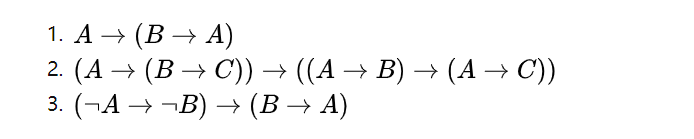
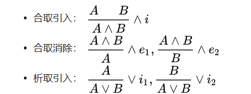
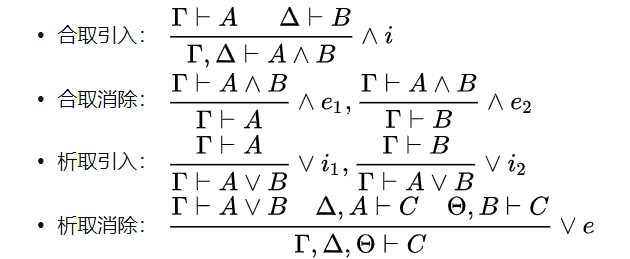
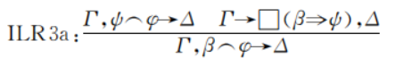
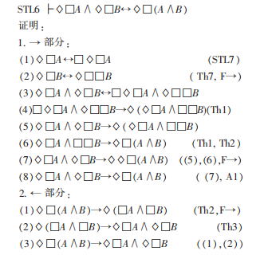
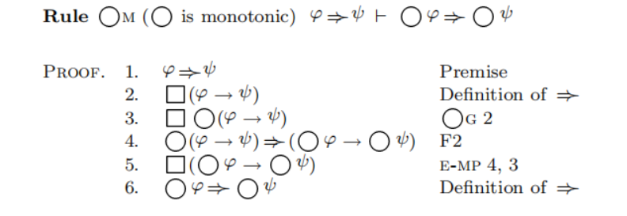

###  PTL


#### 公理系统


#### 推导规则


####  pvs描述

```
    LTL : nonempty_type = boolean
    p,q,r         : var bool
    l,l1,l2       : var LTL

    X  			  : [LTL -> LTL]
    U   		  : [LTL , LTL -> LTL]

    F(l)		  : LTL = U(true,l)
    R(l1,l2)	  : LTL = not (U(not l1 , not l2))
    G(l)		  : LTL = R(false , l)
    W(l1,l2)	  : LTL = U(l1,l2) or G(l1)
```


```
%%% V: pred[form] = (LAMBDA f1: (FORALL env: (FORALL sigma: M(f1)(env,sigma)))) 	
%%% satisfiable(A) : bool = (EXISTS sem : A(sem));
%%% |-(A) : bool = (FORALL sem : A(sem));
	
	|-(l)	  	 	  : bool = l;
    %%% |-(l1 , l2)	  : bool = l1 => l2;
    %%% equal   	  :  lemma |-(l1,l2) <=> |-(l1 => l2)  

    %%% Inference Rules
    INS       :  lemma  if l then |-G(l) else true endif;
    MP	      :  lemma  |-(l1) and |-(l1 => l2)  => |-(l2)
```


#### Future Axiom

```
%%% Future Axiom

    F0        :   axiom |-(G(l)  => l )
    F1	      :   axiom |-(G( X(not l) <=> not X(l) ))
    F2	      :   axiom |-(G( X(l1 => l2) => (X(l1) => X(l2)) ))
    F3	      :   axiom |-(G( G(l1 => l2) => (G(l1) => G(l2)) ))
    F4	      :   axiom |-(G(l) => G(X(l)))
    F5	      :   axiom |-(G(l => X(l))  =>  G(l => G(l)))
    F6	      :   axiom |-(G( U(l1,l2) <=> (l2 or l1 and X(U(l1,l2))) ))
    F7        :   axiom |-(G( U(l1,l2) => F(l2) ))
```


```
    A1	      :	  axiom |-( p => (q => p) )
    A2	      :	  axiom |-( (p => (q => r)) => ((p => q) => (p => r)) )
    A3	      :	  axiom |-( (not p => not q) => (q => p) )
   
    T1	      :	  lemma |-( p => p)
    T2	      :	  lemma |-( (q => r) => ((p => q) => (p => r)) )
```

####Hilbert 公理系统

Hilbert 的公理系统可以写作三个公理模式加一个规则：

![[公式]](https://www.zhihu.com/equation?tex=%28%5Cmathcal%7BA%7D%5Crightarrow%28%5Cmathcal%7BB%7D%5Crightarrow%5Cmathcal%7BA%7D%29%29)
![[公式]](https://www.zhihu.com/equation?tex=%28%28%5Cmathcal%7BA%7D%5Crightarrow%28%5Cmathcal%7BB%7D%5Crightarrow+%5Cmathcal%7BC%7D%29%29%5Crightarrow%28%28%5Cmathcal%7BA%7D%5Crightarrow+%5Cmathcal%7BB%7D%29%5Crightarrow%28%5Cmathcal%7BA%7D%5Crightarrow%5Cmathcal%7BC%7D%29%29%29)
![[公式]](https://www.zhihu.com/equation?tex=%28%28%28%5Cneg%5Cmathcal%7BA%7D%29%5Crightarrow%28%5Cneg%5Cmathcal%7BB%7D%29%29%5Crightarrow%28%5Cmathcal%7BB%7D%5Crightarrow%5Cmathcal%7BA%7D%29%29)

推理规则, MP 规则：![[公式]](https://www.zhihu.com/equation?tex=%5Cphi%2C%5Cphi%5Crightarrow%5Cpsi%5Cvdash%5Cpsi)，中间的![[公式]](https://www.zhihu.com/equation?tex=%5Cvdash)表示证明系统中的推出，并且，这里的![[公式]](https://www.zhihu.com/equation?tex=%5Cphi)和![[公式]](https://www.zhihu.com/equation?tex=%5Cpsi)也都是元语言中代表合式公式的符号。

这种情况下，如果我们要证明![[公式]](https://www.zhihu.com/equation?tex=%5Cemptyset%5Cvdash+p%5Crightarrow+p)（从空集出发能够推出，即表示在系统内可证），那么我们要写出如下命题序列：

```
l1 , l1 => l2 |- l2      <=>    |- l1 => ((l1 => l2) => l2)
```

1. ![[公式]](https://www.zhihu.com/equation?tex=p%5Crightarrow%28%28p%5Crightarrow+p%29%5Crightarrow+p%29)（公理 1）
2. ![[公式]](https://www.zhihu.com/equation?tex=%28+p%5Crightarrow%28+%28p%5Crightarrow+p%29%5Crightarrow+p+%29%29%5Crightarrow%28%28p%5Crightarrow+%28p+%5Crightarrow+p%29%29%5Crightarrow%28p%5Crightarrow+p%29%29)（公理 2）
3. ![[公式]](https://www.zhihu.com/equation?tex=+%28%28p%5Crightarrow+%28p+%5Crightarrow+p%29%29%5Crightarrow%28p%5Crightarrow+p%29%29)（1、2，MP 规则） 
4. ![[公式]](https://www.zhihu.com/equation?tex=+p%5Crightarrow+%28p+%5Crightarrow+p%29)（公理 1）
5. ![[公式]](https://www.zhihu.com/equation?tex=p+%5Crightarrow+p)（4、3，MP 规则） 

```
T2 :  
  |-------
{1}   FORALL (p: boolean): |-(p => p)
Rerunning step: (skolem!)
T2 :  
  |-------
{1}   |-(p!1 => p!1)
Rerunning step: (lemma A1)
T2 :  
{-1}  FORALL (p, q: boolean): |-(p => (q => p))
  |-------
[1]   |-(p!1 => p!1)
Rerunning step: (inst -1 "p!1" "p!1 => p!1")
T2 :  
{-1}  |-(p!1 => ((p!1 => p!1) => p!1))
  |-------
[1]   |-(p!1 => p!1)
Rerunning step: (lemma A2)
T2 :  
{-1}  FORALL (p, q, r: boolean):
        |-((p => (q => r)) => ((p => q) => (p => r)))
[-2]  |-(p!1 => ((p!1 => p!1) => p!1))
  |-------
[1]   |-(p!1 => p!1)
Rerunning step: (inst -1 "p!1" "p!1 => p!1" "p!1")
T2 :  
{-1}  |-((p!1 => ((p!1 => p!1) => p!1)) =>
          ((p!1 => p!1 => p!1) => (p!1 => p!1)))
[-2]  |-(p!1 => ((p!1 => p!1) => p!1))
  |-------
[1]   |-(p!1 => p!1)

Rule? (forward-chain MP)
T2 :  
{-1}  |-(((p!1 => p!1 => p!1) => (p!1 => p!1)))
[-2]  |-((p!1 => ((p!1 => p!1) => p!1)) =>
          ((p!1 => p!1 => p!1) => (p!1 => p!1)))
[-3]  |-(p!1 => ((p!1 => p!1) => p!1))
  |-------
[1]   |-(p!1 => p!1)
Rule? (lemma A1)
T2 :  
{-1}  FORALL (p, q: boolean): |-(p => (q => p))
[-2]  |-(((p!1 => p!1 => p!1) => (p!1 => p!1)))
[-3]  |-((p!1 => ((p!1 => p!1) => p!1)) =>
          ((p!1 => p!1 => p!1) => (p!1 => p!1)))
[-4]  |-(p!1 => ((p!1 => p!1) => p!1))
  |-------
[1]   |-(p!1 => p!1)

Rule? (inst -1 "p!1" "p!1") 
T2 :  
{-1}  |-(p!1 => (p!1 => p!1))
[-2]  |-(((p!1 => p!1 => p!1) => (p!1 => p!1)))
[-3]  |-((p!1 => ((p!1 => p!1) => p!1)) =>
          ((p!1 => p!1 => p!1) => (p!1 => p!1)))
[-4]  |-(p!1 => ((p!1 => p!1) => p!1))
  |-------
[1]   |-(p!1 => p!1)
Rule? (hide -3 -4)
T2 :  

[-1]  |-(p!1 => (p!1 => p!1))
[-2]  |-(((p!1 => p!1 => p!1) => (p!1 => p!1)))
  |-------
[1]   |-(p!1 => p!1)
Rule? (forward-chain MP)
Forward chaining on MP,
Q.E.D.
```

##### R1-proof


##### Rci-proof


#####T3-proof


#####T4-proof


#### 语法推导

- 语义后承（semantic consequence），符号是（\models）。语义后承在一般情况下是连接一个命题集合和一个命题。如果，在任何一种语义赋值下，只要命题集合中的每一个命题都为真，那么就一定为真，那么，我们就说是的语义后承，记作。

- 句法后承（syntactic consequence），符号是（\vdash）。句法后承的用法和语义后承类似，也是连接一个命题集合和一个命题，如，表示的是可以通过**句法证明**的方式从命题集中得出。即，存在一个证明，使得每个前提要么是公理，要么是中的命题，而证明的结论是。具体来说，一个证明是一个命题序列，其中每个命题要么是公理，要么是前提，要么是由前面的命题通过证明规则得到的。其中最后一个称为结论。

- 实质蕴含（material implication / material conditional），符号是（\rightarrow） 。实质蕴含是一个命题逻辑中的二元算子，连接的是两个命题。在句法系统中，由 Hilbert 的前两条公理完全刻画，由第三条公理刻画它和否定的关系。[1] 在语义系统中， 我们说当且仅当或者。就是说，如果一个实质蕴含条件句成立，就是说，前件（上面的 p）为真的情况下，后件（上面的 q）不可能为假。

  

在语义系统中，如果我们要说明 ![[公式]](https://www.zhihu.com/equation?tex=%5Cemptyset%5Cmodels+p%5Crightarrow+p)（即，是空命题集的语义后承，或者说，是永真的），那么我们只需要说明，根据实质蕴含算子的语义规则，对于任何满足了空空命题集的模型 ![[公式]](https://www.zhihu.com/equation?tex=%5Cmathcal+M) （也即，对于任何模型），都有![[公式]](https://www.zhihu.com/equation?tex=%5Cmathcal+M%5CVdash+p%5Crightarrow+p)，而根据定义，这等价于![[公式]](https://www.zhihu.com/equation?tex=%5Cmathcal+M%5CVdash++p) 或者![[公式]](https://www.zhihu.com/equation?tex=%5Cmathcal+M%5Cnot%5CVdash++p) ——这是一个总是能达到的条件。因此，我们会说这个公式是空集的语义后承。

强完全性：对于任意的公式集合![[公式]](https://www.zhihu.com/equation?tex=%5CSigma)，对于任意的公式![[公式]](https://www.zhihu.com/equation?tex=%5Cphi)，如果![[公式]](https://www.zhihu.com/equation?tex=%5CSigma%5Cmodels+%5Cphi)，那么![[公式]](https://www.zhihu.com/equation?tex=%5CSigma+%5Cvdash%5Cphi) 。

强可靠性：对于任意的公式集合![[公式]](https://www.zhihu.com/equation?tex=%5CSigma)，对于任意的公式![[公式]](https://www.zhihu.com/equation?tex=%5Cphi)，如果![[公式]](https://www.zhihu.com/equation?tex=%5CSigma+%5Cvdash%5Cphi)，那么![[公式]](https://www.zhihu.com/equation?tex=%5CSigma%5Cmodels+%5Cphi)。

弱完全性是，方式为真的公式都是可证的；

弱可靠性是，凡是可证的公式都是为真的（事实上我们会这样认为，如果一个公理系统只有弱完全性，那么它还是好的系统，但是如果一个语义系统被弄成只有弱可靠性，那肯定是哪里出了问题）。 在有完全性和可靠性的基础上，没有必要在实际运用中区分两种推出。


#### 演绎定理


### 形式化证明的两种风格

#### Hilbert风格

该风格的证明中每行是一个公式，这个公式称为无条件重言式(unconditional tautology)

典型：

希尔伯特演绎系统

**经典命题逻辑的希尔伯特表示形式：**



####Gentzen风格

该风格的证明中每行是一个相继式，它也称为条件重言式(conditional tautology)

典型：

自然演绎

**经典逻辑的自然演绎形式：**



相继式演算

**相继式演算表示的经典逻辑的自然演绎规则形式：**



### 关于|-

```shell
DCP  
		: THEORY

  BEGIN

  % ASSUMING
  % assuming declarations
  % ENDASSUMING


	%%% NL syntax   Neighbourhood Logic
	Time : TYPE = real;
	Interval : type = {b:Time , e:Time | e >= b};

	GV: type+      %%global variables
	gx: GV

	TV: type+  %%temporal variables
	tv: TV

	Value: type = real
	GV_value : type = [GV -> Value]
	TV_value : type = [TV -> [Interval -> Value]];

	Sem : type = [GV_value , TV_value , Interval];

	i , j : var Interval;
	r , rx : var Value;
	sem : var Sem;

	Term : type = [Sem -> Value];
	Form : type = [Sem -> bool];
	
	t1 ,t2 : var Term
	A , B , C: var Form
	
	+(t1,t2): Term = (lambda sem : t1(sem) + t2(sem));
	>=(t1,t2): Term = (lambda (sem:Sem):t1(sem) >= t2(sem));


	not(A): Form = lambda sem : not A(sem);
	\/(A,B):Form = lambda sem : A(sem) or B(sem);

	=>(A,B): Form =  not A \/ B;
	/\(A,B): Form = not not A \/ not B
	
	tt : Form = lambda sem: 0=0;

	X(A): Form
	G(A): Form
	F(A): Form
	^(A,B): Form

	satisfiable(A) : bool = exists sem: A(sem);
	|-(A)	       : bool = forall sem: A(sem);


	distribute : axiom |- (F(A \/ B) => (F(A) \/ F(B)));
	MP	  	   : lemma |-(A => B) and |-(A) => |-(B);      


  END DCP
```


### ITL

#### 描述

```

    ITL : nonempty_type = boolean

    p,q,r         : var boolean
    l,l1,l2,l3      : var ITL

   
    U  		  : [ITL , ITL -> ITL];
    skip	  : ITL;
    chop	  : [ITL , ITL -> ITL];
    chopstart : [ITL -> ITL];
    

    X(l)	  : ITL = chop(skip , l)
    inf		  : ITL = chop(true , false);
    finite	  : ITL = not inf
    
    %F(l)	  : ITL = U(true,l);
    %G(l)	  : ITL = R(false , l)
    R(l1,l2)  : ITL = not (U(not l1 ,not l2))
    %W(l1,l2) : ITL = U(l1,l2) or G(l1);
    F(l)	  : ITL = chop(finite,l);
    G(l)	  : ITL = not F(not l);

    W_next(l)	  : ITL = not X(not l);
    some_init(l)  : ITL	= chop(l , true);
    all_init(l)	  : ITL = not some_init(not l);
   
    tt		  : ITL = true;
    ff		  : ITL = not tt;
    more	  : ITL	= X(true);
    empty	  : ITL	= not more;
    fin(l)	  : ITL = G(empty => l);
```

#### 推导规则

$$
\Gamma\vdash \Delta      
$$

```
%%% V: pred[form] = (LAMBDA f1: (FORALL env: (FORALL sigma: M(f1)(env,sigma)))) 	
%%% satisfiable(A) : bool = (EXISTS sem : A(sem));
%%% valid(A): bool = (forall sem : A(sem));
%%% |-(A) : bool = (FORALL sem : A(sem));        //   |-(A) : bool = valid(A)
 	
 	
 	

    Gamma	  : var ITL;
    Delta	  : var ITL;
    
    emptyconsequent : ITL = ff;
    emptyantecedent : ITL = tt;

    X			  : var ITL;
    *(Gamma , X)  : ITL = Gamma and X;
    +(Delta , X)  : ITL = Delta or X;
    
    SQT(Gamma , Delta) : Gamma => Delta;     
    
    |-(Delta) : bool = SQT(emptyantecedent , Delta)
    
    MP		 :  axiom  |-(l1) and |-(l1 => l2)  => |-(l2);
```




```
    chop_left  : lemma  SQT(Gamma * chop(l1,l2) , Delta) and SQT(Gamma , Delta + G(l => l1))
    	     		 implies  SQT(Gamma * chop(l,l2) , Delta)
```


####RightChopImplChop-proof


```
  RightChopImplChop   :  lemma  |-( l=>l1 ) => |-(chop(l2,l) => chop(l2,l1))
```

```
  BoxGen    		  :  axiom  |-(l) => |- (G(l))
```

```
  BoxChopImpChop	  :  lemma  |-( G(l => l1) => (chop(l2,l) => chop(l2,l1)) )
```


```shell
RightChopImplChop :  

  |-------
{1}   FORALL (l, l1, l2: ITL):
        |-(l => l1) => |-(chop(l2, l) => chop(l2, l1))

Rule? (skolem!)
Skolemizing,
this simplifies to: 
RightChopImplChop :  

  |-------
{1}   |-(l!1 => l1!1) => |-(chop(l2!1, l!1) => chop(l2!1, l1!1))

Rule? (flatten)
Applying disjunctive simplification to flatten sequent,
this simplifies to: 
RightChopImplChop :  

{-1}  |-(l!1 => l1!1)
  |-------
{1}   |-(chop(l2!1, l!1) => chop(l2!1, l1!1))

Rule? (lemma BoxGen)
Applying BoxGen 
this simplifies to: 
RightChopImplChop :  

{-1}  FORALL (l: ITL): |-(l) => |-(G(l))
[-2]  |-(l!1 => l1!1)
  |-------
[1]   |-(chop(l2!1, l!1) => chop(l2!1, l1!1))

Rule? (inst -1 "l!1 => l1!1")
Instantiating the top quantifier in -1 with the terms: 
 l!1 => l1!1,
this simplifies to: 
RightChopImplChop :  

{-1}  |-(l!1 => l1!1) => |-(G(l!1 => l1!1))
[-2]  |-(l!1 => l1!1)
  |-------
[1]   |-(chop(l2!1, l!1) => chop(l2!1, l1!1))

Rule? (split)
Splitting conjunctions,
this yields  2 subgoals: 
RightChopImplChop.1 :  

{-1}  |-(G(l!1 => l1!1))
[-2]  |-(l!1 => l1!1)
  |-------
[1]   |-(chop(l2!1, l!1) => chop(l2!1, l1!1))

Rule? (lemma BoxChopImpChop)
Applying BoxChopImpChop 
this simplifies to: 
RightChopImplChop.1 :  

{-1}  FORALL (l, l1, l2: ITL):
        |-(G(l => l1) => (chop(l2, l) => chop(l2, l1)))
[-2]  |-(G(l!1 => l1!1))
[-3]  |-(l!1 => l1!1)
  |-------
[1]   |-(chop(l2!1, l!1) => chop(l2!1, l1!1))

Rule? (inst -1 l!1 l1!1 l2!1)
Instantiating the top quantifier in -1 with the terms: 
 l!1, l1!1, l2!1,
this simplifies to: 
RightChopImplChop.1 :  

{-1}  |-(G(l!1 => l1!1) => (chop(l2!1, l!1) => chop(l2!1, l1!1)))
[-2]  |-(G(l!1 => l1!1))
[-3]  |-(l!1 => l1!1)
  |-------
[1]   |-(chop(l2!1, l!1) => chop(l2!1, l1!1))

Rule? (forward-chain MP)
Forward chaining on MP,

This completes the proof of RightChopImplChop.1.

RightChopImplChop.2 :  

[-1]  |-(l!1 => l1!1)
  |-------
{1}   |-(l!1 => l1!1)
[2]   |-(chop(l2!1, l!1) => chop(l2!1, l1!1))

which is trivially true.

This completes the proof of RightChopImplChop.2.

Q.E.D.
```

#### 问题

+ 内部变化不够灵活

  ```shell
  T3 :  
  
    |-------
  {1}   FORALL (l1, l2: ITL): |-( G(X(l1 AND l2) <=> (X(l1) AND X(l2))) )
  
  Rule? (skolem!)
  Skolemizing,
  this simplifies to: 
  T3 :  
  
    |-------
  {1}   |-(G(X(l1!1 AND l2!1) <=> (X(l1!1) AND X(l2!1))))
  
  Rule? #### "|-"内部的双向蕴含       证明过程中"|-"
  ```

  

+ ```shell
  l1 => l2 |- X(l1) => X(l2)       l1 作为前提    如何在证明过程中引入前提。
  ```

  



