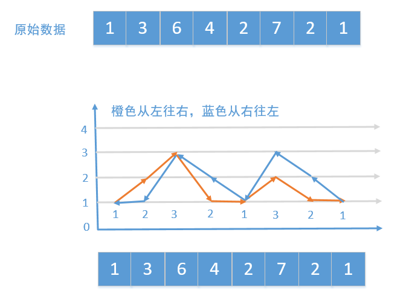
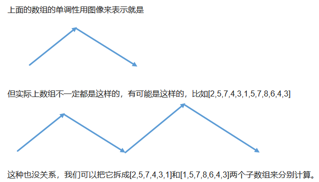

### 回溯

##### [剑指 Offer 34. 二叉树中和为某一值的路径](https://leetcode-cn.com/problems/er-cha-shu-zhong-he-wei-mou-yi-zhi-de-lu-jing-lcof/)

+ 描述

  ```shell
   输入一棵二叉树和一个整数，打印出二叉树中节点值的和为输入整数的所有路径。从树的根节点开始往下一直到叶节点所经过的节点形成一条路径。
   			  5
               / \
              4   8
             /   / \
            11  13  4
           /  \    / \
          7    2  5   1      
  ```

+ 题解

  ```java
  class Solution {
  
      private  List<List<Integer>> res;
  
      public List<List<Integer>> pathSum(TreeNode root, int sum) {
          //回溯
          res = new ArrayList<>();
          backtrack(root , sum , new ArrayList<>());
          return res;
      }
  
      private void backtrack(TreeNode node, int target, List<Integer> list) {
          if (node == null) {
              return;
          }
          list.add(node.val);
          target =  target -node.val;
          if (target == 0 && node.left == null && node.right == null) {
              res.add(new ArrayList<>(list));
          } else {
              backtrack(node.left, target, list);
              backtrack(node.right, target, list);
          }
          list.remove(collector.size() - 1);
      }
  }
  ```

  

  ```java
  class Solution {
      LinkedList<List<Integer>> res = new LinkedList<>();
      LinkedList<Integer> path = new LinkedList<>(); 
  
      public List<List<Integer>> pathSum(TreeNode root, int sum) {
          recur(root, sum);
          return res;
      }
      
      void recur(TreeNode root, int tar) {
          if(root == null) return;
          path.add(root.val);
          tar -= root.val;
          if(tar == 0 && root.left == null && root.right == null)
              res.add(new LinkedList(path));
          recur(root.left, tar);
          recur(root.right, tar);
          path.removeLast();
      }
  }
  ```


#####[842. 将数组拆分成斐波那契序列](https://leetcode-cn.com/problems/split-array-into-fibonacci-sequence/)

+ 描述

  ```shell
  给定一个数字字符串 S，比如 S = "123456579"，我们可以将它分成斐波那契式的序列 [123, 456, 579]。
  
  形式上，斐波那契式序列是一个非负整数列表 F，且满足：
  
      0 <= F[i] <= 2^31 - 1，（也就是说，每个整数都符合 32 位有符号整数类型）；
      F.length >= 3；
      对于所有的0 <= i < F.length - 2，都有 F[i] + F[i+1] = F[i+2] 成立。
  
  另外，请注意，将字符串拆分成小块时，每个块的数字一定不要以零开头，除非这个块是数字 0 本身。
  
  返回从 S 拆分出来的任意一组斐波那契式的序列块，如果不能拆分则返回 []。
  
  
  示例 1：
  
  输入："123456579"
  输出：[123,456,579]
  
  示例 2：
  
  输入: "11235813"
  输出: [1,1,2,3,5,8,13]
  ```

  

+ 题解

  ```java
  class Solution {
      public List<Integer> splitIntoFibonacci(String S) {
          List<Integer> list = new ArrayList<>();
          backtrack(S.toCharArray(),list,0);
          return list;
      }
  
      public boolean backtrack(char[] digit, List<Integer> res,int index){
          // 边界条件判断，如果截取完了，并且res长度大于等于3，表示找到了一个组合。
          if(index == digit.length && res.size() >= 3){
              return true;
          }
          for(int i = index; i < digit.length; i++){
              // 两位以上的数字不能以0开头
              if(digit[index] == '0' && i > index){
                  break;
              }
              // 截取字符串转化为数字
              long num = subDigit(digit,index,i+1);
              // 如果截取的数字大于int的最大值，则终止截取
              if(num > Integer.MAX_VALUE){
                  break;
              }
              int size = res.size();
              // 如果截取的数字大于res中前两个数字的和，说明这次截取的太大，直接终止，因为后面越截取越大
              if(size <= 1 || num == res.get(size-1) + res.get(size-2)){
                  // 把数字num添加到集合res中
                  res.add((int)num);
                  // 如果找到了就直接返回
                  if(backtrack(digit,res,i+1))
                      return true;
                  // 如果没找到，就会走回溯这一步，然后把上一步添加到集合res中的数字给移除掉
                  res.remove(res.size()-1);
              }
          }
          return false;
      }
  
      // 相当于截取字符串S中的子串然后转换为十进制数字
      private long subDigit(char[] digit,int start,int end){
          long res = 0;
          for(int i = start; i < end; i++){
              res = res * 10 + digit[i] - '0';
          }
          return res;
      }
  }
  ```

##### 

### BFS:广度优先遍历

##### [103. 二叉树的锯齿形层序遍历](https://leetcode-cn.com/problems/binary-tree-zigzag-level-order-traversal/)

+ 描述

  ```shell
  给定一个二叉树，返回其节点值的锯齿形层序遍历。（即先从左往右，再从右往左进行下一层遍历，以此类推，层与层之间交替进行）。
  
  例如：
  给定二叉树 [3,9,20,null,null,15,7],
  
   	3
     / \
    9  20
      /  \
     15   7
     
  返回锯齿形层序遍历如下：
  
  [
    [3],
    [20,9],
    [15,7]
  ]
  ```

+ 题解

  ```java
  class Solution {
      public List<List<Integer>> zigzagLevelOrder(TreeNode root) {
          List<List<Integer>> res = new ArrayList<>();
  
          if(root == null)
              return res;
          
          Queue<TreeNode> queue = new LinkedList<>();
  
          boolean isright = true;
          queue.add(root);
          while(!queue.isEmpty()){
  
              List<Integer> temp = new ArrayList<>();
              
              int size = queue.size();
              for(int i = 0 ; i < size ; i++){
                  TreeNode node = queue.poll();
                  if(isright){
                      temp.add(node.val);
                  }else{
                      temp.add(0,node.val);
                  }
                  if(node.left != null)
                      queue.add(node.left); 
                  
                  if(node.right != null)
                      queue.add(node.right);              
              }
              res.add(temp);
              isright = !isright;
          }
  
          return res;
      }
  }
  ```


##### 

### DFS:深度优先遍历

#####[103. 二叉树的锯齿形层序遍历](https://leetcode-cn.com/problems/binary-tree-zigzag-level-order-traversal/)

+ 描述

  ```shell
  给定一个二叉树，返回其节点值的锯齿形层序遍历。（即先从左往右，再从右往左进行下一层遍历，以此类推，层与层之间交替进行）。
  
  例如：
  给定二叉树 [3,9,20,null,null,15,7],
  
   	3
     / \
    9  20
      /  \
     15   7
     
  返回锯齿形层序遍历如下：
  
  [
    [3],
    [20,9],
    [15,7]
  ]
  ```

+ 题解

  ```java
  class Solution {
      public List<List<Integer>> zigzagLevelOrder(TreeNode root) {
        List<List<Integer>> res = new ArrayList<>();
  
          traversal(root , res , 0);
          return res;
      }
  
      private void traversal(TreeNode root , List<List<Integer>> res , int lever){
          if (root == null)
              return;
          if(res.size() == lever)
              res.add(new ArrayList<Integer>());
          if((lever & 1) ==1)
              res.get(lever).add(0,root.val);         //奇数
          else
              res.get(lever).add(root.val);
  
          traversal(root.left , res , lever+1);
          traversal(root.right , res , lever+1);
      }
  }
  ```
  
  

### 数组

##### [321. 拼接最大数](https://leetcode-cn.com/problems/create-maximum-number/)

+ 描述

  ```shell
  给定长度分别为 m 和 n 的两个数组，其元素由 0-9 构成，表示两个自然数各位上的数字。现在从这两个数组中选出 k (k <= m + n) 个数字拼接成一个新的数，要求从同一个数组中取出的数字保持其在原数组中的相对顺序。
  
  求满足该条件的最大数。结果返回一个表示该最大数的长度为 k 的数组。
  
  说明: 请尽可能地优化你算法的时间和空间复杂度。
  
  示例 1:
  
  输入:
  nums1 = [3, 4, 6, 5]
  nums2 = [9, 1, 2, 5, 8, 3]
  k = 5
  输出:
  [9, 8, 6, 5, 3]
  
  示例 2:
  
  输入:
  nums1 = [6, 7]
  nums2 = [6, 0, 4]
  k = 5
  输出:
  [6, 7, 6, 0, 4]
  
  来源：力扣（LeetCode）
  链接：https://leetcode-cn.com/problems/create-maximum-number
  著作权归领扣网络所有。商业转载请联系官方授权，非商业转载请注明出处。
  ```

  

+ 题解

  ```java
  class Solution {
      /*
      假设数组一为[3,4,6,5]、数组二为[9,1,2,5,8,3]、k = 5;
      组合情况有0 + 5、1 + 4、2 + 3、3 + 2、4 + 1五种情况,就是从此五种情况取出组合最大的一种;
      Math.max(0, k - n)表示若数组二的元素个数 >= k,则数组一的元素个数可以从0开始取,否则在数组二的大小基础上补.
      */
      public int[] maxNumber(int[] nums1, int[] nums2, int k) {
          int m = nums1.length, n = nums2.length;
          int[] res = new int[k];
          for (int i = Math.max(0, k - n); i <= k && i <= m; i++) {
              int[] arr = merge(maxArr(nums1, i), maxArr(nums2, k - i), k);
              if (gt(arr, 0, res, 0)) res = arr;
          }
          return res;
      }
  
      /*
      假设选择了2 + 3的情况,分别从两个数组取出相应元素个数的最大组合，对数组一来说就是[6,5],对数组二来说是[9,8,3];
      n - i : 当前数组中,当前下标到结尾还有多少个元素;
      j : 当前数组中i之前有多少个数加入到最大组合中;
      n - i + j > k <=> n - i - 1 + j >= k : 当前下标的元素大于最大组合的末尾元素，就需要弹出,弹出后的元素减少,故j--,
      n - i(数组剩余元素) - 1(去掉最大组合末尾元素) + j(最大组合中剩余元素)时刻保持 >= k;
      if j < k : 先将最大组合填满再进行比较替换操作
      */
      private int[] maxArr(int[] nums, int k) {
          int n = nums.length;
          int[] res = new int[k];
          for (int i = 0, j = 0; i < n; i++) {
              while (n - i + j > k && j > 0 && nums[i] > res[j-1]) j--;
              if (j < k) res[j++] = nums[i];
          }
          return res;
      }
  
      /*
      假设数组一最大组合为[6,5],数组二最大组合为[9,8,3],进行双指针排序,排序后为[9,8,6,5,3]
      */
      private int[] merge(int[] nums1, int[] nums2, int k) {
          int[] res = new int[k];
          for (int i = 0, j = 0, r = 0; r < k; r++)
              res[r] = gt(nums1, i, nums2, j) ? nums1[i++] : nums2[j++];
          return res;
      }
  
      /*
      比较两数组相应位置大小,相等就一直跳过,直到不相等就比较.
      */
      private boolean gt(int[] nums1, int i, int[] nums2, int j) {
          while (i < nums1.length && j < nums2.length && nums1[i] == nums2[j]) {
              i++;
              j++;
          }
          return j == nums2.length || (i < nums1.length && nums1[i] > nums2[j]);
      }
  }
  ```

### 贪心

#####[135. 分发糖果](https://leetcode-cn.com/problems/candy/)

+ 描述

  ```java
  老师想给孩子们分发糖果，有 N 个孩子站成了一条直线，老师会根据每个孩子的表现，预先给他们评分。
  
  你需要按照以下要求，帮助老师给这些孩子分发糖果：
  
      每个孩子至少分配到 1 个糖果。
      相邻的孩子中，评分高的孩子必须获得更多的糖果。
  
  那么这样下来，老师至少需要准备多少颗糖果呢？
  
  示例 1:
  
  输入: [1,0,2]
  输出: 5
  解释: 你可以分别给这三个孩子分发 2、1、2 颗糖果。
  
  示例 2:
  
  输入: [1,2,2]
  输出: 4
  解释: 你可以分别给这三个孩子分发 1、2、1 颗糖果。
       第三个孩子只得到 1 颗糖果，这已满足上述两个条件。
  ```

+ 题解

  + 两次遍历

    

  ```java
  class Solution {
      public int candy(int[] ratings) {
          if(ratings == null || ratings.length == 0){
              return 0;
          }
          int[] nums = new int[ratings.length];//记录每一位孩子得到的糖果数
          nums[0] = 1;
          //先正序遍历，如果后一位比前一位高分，就给比前一位多1的糖果，否则给1
          for(int i = 1; i < ratings.length; i++){
              if(ratings[i] > ratings[i-1]){
                  nums[i] = nums[i-1] + 1;        
              }else {
                  nums[i] = 1;
              }
          }
          //在倒叙遍历，如果前一位比后一位高分并且得到的糖果小于或等于后一位，就给前一位孩子比后一位孩子多一个糖果
          for(int i = ratings.length -2 ; i >= 0; i--){
              if(ratings[i] > ratings[i+1] && nums[i] <= nums[i+1]){
                  nums[i] = nums[i+1] +1;
              }
          }
          int count = 0;
          for(int i : nums){
              count +=i;
          }
          return count;
      }
  }
  ```

  + 一次遍历会有3种情况
    1，当前孩子的评分比左边的高，也就是递增的，那么当前孩子的糖果数量要比左边个多1。
    2，当前孩子的评分等于左边孩子的评分，我们让他降为1,也就是说当前孩子的糖果是1，最终是不是1,后面还需要在判断。
    3，当前孩子的评分低于左边孩子的评分，也就是递减的，这个我们就没法确定当前孩子的糖果了，但我们可以统计递减孩子的数量（我们可以反向思考，这个递减的序列中，最后一个肯定是1，并且从后往前都逐渐增加的）

    举个例子，比如数组是[1,3,4,6,8,5,3,1]，8是得分的最高点，8前面的从1开始都是递增的，8后面的从5开始是递减的。也就是说8前面的从1到6，每个孩子的糖果数量分别是[1,2,3,4],那么8后面的从5到1每个孩子的糖果数量分别是[3,2,1]。那么8的糖果数量就是左右两边的最大值加1，也就是4+1=5。
    所以8左边糖果的数量是(1+4)*4/2=10，右边的糖果数量是(1+3)*3/2=6，所以总的糖果数量是10+6+5=21

  

  

  

  ```java
   public int candy(int[] ratings) {
          int length = ratings.length;
          if (length == 1)
              return 1;
          //记录访问到哪个孩子了
          int index = 0;
          //记录总共的糖果
          int total = 0;
          while (index < length - 1) {
              int left = 0;
              //统计递增的长度
              while (index < length - 1 && ratings[index + 1] > ratings[index]) {
                  index++;
                  left++;
              }
              int right = 0;
              //统计递减的长度
              while (index < length - 1 && ratings[index + 1] < ratings[index]) {
                  index++;
                  right++;
              }
              //记录顶点的值，也就是左右两边最大的值加1
              int peekCount = Math.max(left, right) + 1;
              //注意这里如果total不等于0要减1，是因为把数组拆分成子数组的时候，低谷的那
              //个会被拆到两个数组中，如果total不等于0，说明之前已经统计过，而下面会再次
              //统计，所以要提前减去。
              if (total != 0)
                  total--;
              //当前这个子数组的糖果数量就是前面递增的加上后面递减的然后在加上顶点的。
              total += (1 + left) * left / 2 + (1 + right) * right / 2 + peekCount;
              //如果当前孩子的得分和前一个一样，我们让他降为1
              while (index < length - 1 && ratings[index + 1] == ratings[index]) {
                  index++;
                  total++;
              }
          }
          return total;
      }
  ```

  