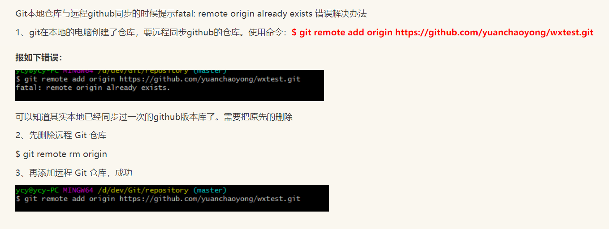

###Git

#### 版本控制

+ 版本迭代   更新  新的版本

+ 多人团队开发 代码一致性  软件整合

+ 版本恢复

+ 主流版本控制器

  + Git
  + SVN
  + CVS

+ 分类

  + 本地版本控制

    

  + 集中式SVN

    

  + 分布式版本控制Git

    

  + SVN与Git区别

    

#### Git历史


#### Git环境配置

+ 下载安装

  

+ Git  Bash

  与Unix Linux 风格类似   推荐

  

+ Git CMD     window风格

+ Git GUI   图形化   不推荐

+ 基本命令

  + cd ..         ls     touch
  + pwd       rm       mkdir       rm -f
  + mv  
  + reset
  + history

  ##### 查看配置

  ```shell
  git config -l
  Lenovo@DESKTOP-J5DASFT MINGW64 ~/Desktop
  $ git config -l
  diff.astextplain.textconv=astextplain
  filter.lfs.clean=git-lfs clean -- %f
  filter.lfs.smudge=git-lfs smudge -- %f
  filter.lfs.process=git-lfs filter-process
  filter.lfs.required=true
  http.sslbackend=openssl
  http.sslcainfo=C:/java/Git/mingw64/ssl/certs/ca-bundle.crt
  core.autocrlf=true
  core.fscache=true
  core.symlinks=false
  pull.rebase=false
  credential.helper=manager-core
  credential.https://dev.azure.com.usehttppath=true
  user.name=Lenovo
  user.email=2274474105@qq.com
  
  ```

  

  

   设置用户名与邮箱（用户标识，必要）

  当你安装Git后首先要做的事情是设置你的用户名称和e-mail地址。这是非常重要的，因为每次Git提交都会使用该信息。它被永远的嵌入到了你的提交中：

  ```
  git config --global user.name "kuangshen"  #名称
  git config --global user.email 24736743@qq.com   #邮箱
  ```

  只需要做一次这个设置，如果你传递了--global 选项，因为Git将总是会使用该信息来处理你在系统中所做的一切操作。如果你希望在一个特定的项目中使用不同的名称或e-mail地址，你可以在该项目中运行该命令而不要--global选项。总之--global为全局配置，不加为某个项目的特定配置。

#### Git基本理论

#####三个区域

Git本地有三个工作区域：工作目录（Working Directory）、暂存区(Stage/Index)、资源库(Repository或Git Directory)。如果在加上远程的git仓库(Remote Directory)就可以分为四个工作区域。文件在这四个区域之间的转换关系如下：


- Workspace：工作区，就是你平时存放项目代码的地方

- Index / Stage：暂存区，用于临时存放你的改动，事实上它只是一个文件，保存即将提交到文件列表信息

- Repository：仓库区（或本地仓库），就是安全存放数据的位置，这里面有你提交到所有版本的数据。其中HEAD指向最新放入仓库的版本

- Remote：远程仓库，托管代码的服务器，可以简单的认为是你项目组中的一台电脑用于远程数据交换

- 本地的三个区域确切的说应该是git仓库中HEAD指向的版本：

  

  - Directory：使用Git管理的一个目录，也就是一个仓库，包含我们的工作空间和Git的管理空间。
  - WorkSpace：需要通过Git进行版本控制的目录和文件，这些目录和文件组成了工作空间。
  - .git：存放Git管理信息的目录，初始化仓库的时候自动创建。
  - Index/Stage：暂存区，或者叫待提交更新区，在提交进入repo之前，我们可以把所有的更新放在暂存区。
  - Local Repo：本地仓库，一个存放在本地的版本库；HEAD会只是当前的开发分支（branch）。
  - Stash：隐藏，是一个工作状态保存栈，用于保存/恢复WorkSpace中的临时状态。

##### 工作流程

git的工作流程一般是这样的：

１、在工作目录中添加、修改文件；

２、将需要进行版本管理的文件放入暂存区域；

３、将暂存区域的文件提交到git仓库。

因此，git管理的文件有三种状态：已修改（modified）,已暂存（staged）,已提交(committed)


#### Git项目搭建

##### 创建工作目录与常用指令

工作目录（WorkSpace)一般就是你希望Git帮助你管理的文件夹，可以是你项目的目录，也可以是一个空目录，建议不要有中文。

日常使用只要记住下图6个命令


##### 本地仓库搭建

创建本地仓库的方法有两种：一种是创建全新的仓库，另一种是克隆远程仓库。

1、创建全新的仓库，需要用GIT管理的项目的根目录执行：

```
# 在当前目录新建一个Git代码库
$ git init
```


2、执行后可以看到，仅仅在项目目录多出了一个.git目录，关于版本等的所有信息都在这个目录里面。

##### 克隆远程仓库

1、另一种方式是克隆远程目录，由于是将远程服务器上的仓库完全镜像一份至本地！

```
# 克隆一个项目和它的整个代码历史(版本信息)
$ git clone [url]  # https://gitee.com/kuangstudy/openclass.git
```


2、去 gitee 或者 github 上克隆一个测试！


#### Git文件操作

#####文件的四种状态

版本控制就是对文件的版本控制，要对文件进行修改、提交等操作，首先要知道文件当前在什么状态，不然可能会提交了现在还不想提交的文件，或者要提交的文件没提交上。

- Untracked: 未跟踪, 此文件在文件夹中, 但并没有加入到git库, 不参与版本控制. 通过git add 状态变为Staged.
- Unmodify: 文件已经入库, 未修改, 即版本库中的文件快照内容与文件夹中完全一致. 这种类型的文件有两种去处, 如果它被修改, 而变为Modified. 如果使用git rm移出版本库, 则成为Untracked文件
- Modified: 文件已修改, 仅仅是修改, 并没有进行其他的操作. 这个文件也有两个去处, 通过git add可进入暂存staged状态, 使用git checkout 则丢弃修改过, 返回到unmodify状态, 这个git checkout即从库中取出文件, 覆盖当前修改 !
- Staged: 暂存状态. 执行git commit则将修改同步到库中, 这时库中的文件和本地文件又变为一致, 文件为Unmodify状态. 执行git reset HEAD filename取消暂存, 文件状态为Modified

#####查看文件状态

上面说文件有4种状态，通过如下命令可以查看到文件的状态：

```
#查看指定文件状态
git status [filename]
#查看所有文件状态
git status
# git add .         添加所有文件到暂存区
# git commit -m "消息内容"    提交暂存区中的内容到本地仓库 -m 提交信息
```


#####忽略文件

有些时候我们不想把某些文件纳入版本控制中，比如数据库文件，临时文件，设计文件等

在主目录下建立".gitignore"文件，此文件有如下规则：

1. 忽略文件中的空行或以井号（#）开始的行将会被忽略。
2. 可以使用Linux通配符。例如：星号（*）代表任意多个字符，问号（？）代表一个字符，方括号（[abc]）代表可选字符范围，大括号（{string1,string2,...}）代表可选的字符串等。
3. 如果名称的最前面有一个感叹号（!），表示例外规则，将不被忽略。
4. 如果名称的最前面是一个路径分隔符（/），表示要忽略的文件在此目录下，而子目录中的文件不忽略。
5. 如果名称的最后面是一个路径分隔符（/），表示要忽略的是此目录下该名称的子目录，而非文件（默认文件或目录都忽略）。

```
#为注释
*.txt        #忽略所有 .txt结尾的文件,这样的话上传就不会被选中！
!lib.txt     #但lib.txt除外
/temp       #仅忽略项目根目录下的TODO文件,不包括其它目录temp
build/       #忽略build/目录下的所有文件
doc/*.txt    #会忽略 doc/notes.txt 但不包括 doc/server/arch.txt
```

#### gitee

+ 注册登录码云，完善个人信息

+ 设置本机绑定SSH公钥，实现免密码登录！（免密码登录，这一步挺重要的，码云是远程仓库，我们是平时工作在本地仓库！)

  

  

  

  ```
  # 进入 C:\Users\Administrator\.ssh 目录
  # 生成公钥
  ssh-keygen
  ```

+ 将公钥信息public key 添加到码云账户中即可！

+ 使用码云创建一个自己的仓库！

  

  

+ 修改文件后  同步

  

+ 远程仓库查看

  

#### IDEA集成

+ 新建项目，绑定git。

  

  + 拷贝gitstudy  到项目中

  

  

  

+ 修改文件，使用IDEA操作git。

  

  

  + 修改某个

    

  

  

  - 添加到暂存区    变绿色

    

  - commit 提交   到本地

    

    

  - push到远程仓库

    

    

+ 提交测试

  

  

  


​		

####Git分支


##### 常用指令

```shell

# 列出所有本地分支
git branch

# 列出所有远程分支
git branch -r

# 新建一个分支，但依然停留在当前分支
git branch [branch-name]

# 新建一个分支，并切换到该分支
git checkout -b [branch]

# 合并指定分支到当前分支
$ git merge [branch]

# 删除分支
$ git branch -d [branch-name]

# 删除远程分支
$ git push origin --delete [branch-name]
$ git branch -dr [remote/branch]
```

+ IDEA中操作

  

如果同一个文件在合并分支时都被修改了则会引起冲突：解决的办法是我们可以修改冲突文件后重新提交！选择要保留他的代码还是你的代码！

master主分支应该非常稳定，用来发布新版本，一般情况下不允许在上面工作，工作一般情况下在新建的dev分支上工作，工作完后，比如上要发布，或者说dev分支代码稳定后可以合并到主分支master上来。


#### 实战


git命令工具Git Bash 。 

首先在Git Bash中使用cd命令进入对应的本地项目路录，按照下面的命令操作： 

+ git init 表示在当前的项目目录中生成本地的git管理。

+ git add . 表示你要提交到github上的文件，如果你要将所有文件都添加上去的话，使用git add . “.”表示添加当前目录中的所有文件。

+ git commit -m “first commit”,表示你对这次提交的注释。

+ git commit -m “提交的描述信息” 
  如果我们这里不用-m参数的话，git将调到一个文本编译器（通常是vim）来让你输入提交的描述信息

  + git commit -a -m “提交的描述信息” 
  + git commit 命令的-a 选项可只将所有被修改或者已删除的且已经被git管理的文档提交倒仓库中。如果只是修改或者删除了已被Git 管理的文档，是没必要使用git add 命令的。

  + git commit –-amend 对于已经修改提交过的注释，如果需要修改，可以借助 git commit –-amend 来进行。

+ git remote add origin https://github.com/wx_kun/workspace    就是项目地址。

+ git push -u origin master 用于将本地分支的更新，推送到远程主机，最后根据提示输入用户名和密码。-u选项指定一个默认主机。
+ 注意：这一步可能会提示你： ! [rejected]     master -> master (fetch first)，这事因为git仓库已经有内容了，这时你需要先利用git pull命令同步代码，步骤如下：
  + 直接用git pull origin <分支名称（默认master）> 拉下服务器代码，如果没问题即解决了。
  + 如果提示：fatal:refusing to merge unrelated histories，
  + 这时执行如下命令:git branch --set-upstream-to=origin/<分支名称> master，
  + 之后执行git pull origin master --allow-unrelated-histories，即可拉下代码，
+ 然后调用git push -u origin master即可上传代码。


```shell
Lenovo@DESKTOP-J5DASFT MINGW64 ~/Desktop/MyTyporaNote
$ git init
Initialized empty Git repository in C:/Users/Lenovo/Desktop/MyTyporaNote/.git/

Lenovo@DESKTOP-J5DASFT MINGW64 ~/Desktop/MyTyporaNote (master)
$ git add .
warning: LF will be replaced by CRLF in LTL证明/ITL_mix.md.
The file will have its original line endings in your working directory
............................
The file will have its original line endings in your working directory

Lenovo@DESKTOP-J5DASFT MINGW64 ~/Desktop/MyTyporaNote (master)
$ git commit -m "图片相对路径"
[master (root-commit) 4843e4c] 图片相对路径
 198 files changed, 15951 insertions(+)
 create mode 100644 "LTL\350\257\201\346\230\216/ITL_mix.assets/image-20201218171418012.png"
 create mode 100644 "LTL\350\257\201\346\230\216/ITL_mix.assets/image-20201218171427133.png"
............57704.png
 create mode 100644 pvs/image-20200929102608512.png
 create mode 100644 pvs/image-20200929111449180.png
 create mode 100644 "pvs/\345\237\272\344\272\216PVS\347\232\204ITL\345\256\232\347\220\206\350\257\201\346\230\216.md"
 create mode 100644 "pvs/\346\225\231\347\250\213.md"

Lenovo@DESKTOP-J5DASFT MINGW64 ~/Desktop/MyTyporaNote (master)
$ git remote add origin https://gitee.com/w_xkun/MyTyporaNote

Lenovo@DESKTOP-J5DASFT MINGW64 ~/Desktop/MyTyporaNote (master)
$ git push -u origin master
To https://gitee.com/w_xkun/MyTyporaNote
 ! [rejected]        master -> master (fetch first)
error: failed to push some refs to 'https://gitee.com/w_xkun/MyTyporaNote'           ####error
hint: Updates were rejected because the remote contains work that you do
hint: not have locally. This is usually caused by another repository pushing
hint: to the same ref. You may want to first integrate the remote changes
hint: (e.g., 'git pull ...') before pushing again.
hint: See the 'Note about fast-forwards' in 'git push --help' for details.

Lenovo@DESKTOP-J5DASFT MINGW64 ~/Desktop/MyTyporaNote (master)
$ git pull origin master
remote: Enumerating objects: 215, done.
remote: Counting objects: 100% (215/215), done.
remote: Compressing objects: 100% (210/210), done.
remote: Total 215 (delta 1), reused 210 (delta 1), pack-reused 0
Receiving objects: 100% (215/215), 12.16 MiB | 655.00 KiB/s, done.
Resolving deltas: 100% (1/1), done.
From https://gitee.com/w_xkun/MyTyporaNote
 * branch            master     -> FETCH_HEAD
 * [new branch]      master     -> origin/master
fatal: refusing to merge unrelated histories

Lenovo@DESKTOP-J5DASFT MINGW64 ~/Desktop/MyTyporaNote (master)
$ git branch --set-upstream-to=origin/master
Branch 'master' set up to track remote branch 'master' from 'origin'.

Lenovo@DESKTOP-J5DASFT MINGW64 ~/Desktop/MyTyporaNote (master)
$ git pull origin master --allow-unrelated-histories
From https://gitee.com/w_xkun/MyTyporaNote
 * branch            master     -> FETCH_HEAD
CONFLICT (add/add): Merge conflict in java/docker.md
Auto-merging java/docker.md
CONFLICT (add/add): Merge conflict in java/Git.md
Auto-merging java/Git.md
CONFLICT (add/add): Merge conflict in LTL证明/LTL证明7.md
Auto-merging LTL证明/LTL证明7.md
CONFLICT (add/add): Merge conflict in LTL证明/LTL证明6.md
Auto-merging LTL证明/LTL证明6.md
CONFLICT (add/add): Merge conflict in LTL证明/LTL证明5.md
Auto-merging LTL证明/LTL证明5.md
Automatic merge failed; fix conflicts and then commit the result.

Lenovo@DESKTOP-J5DASFT MINGW64 ~/Desktop/MyTyporaNote (master|MERGING)
$ git push -u origin master
To https://gitee.com/w_xkun/MyTyporaNote
 ! [rejected]        master -> master (non-fast-forward)          ####error
error: failed to push some refs to 'https://gitee.com/w_xkun/MyTyporaNote'
hint: Updates were rejected because the tip of your current branch is behind
hint: its remote counterpart. Integrate the remote changes (e.g.
hint: 'git pull ...') before pushing again.
hint: See the 'Note about fast-forwards' in 'git push --help' for details.

Lenovo@DESKTOP-J5DASFT MINGW64 ~/Desktop/MyTyporaNote (master|MERGING)
$ git pull origin master
error: Pulling is not possible because you have unmerged files.            ####error
hint: Fix them up in the work tree, and then use 'git add/rm <file>'
hint: as appropriate to mark resolution and make a commit.
fatal: Exiting because of an unresolved conflict.

Lenovo@DESKTOP-J5DASFT MINGW64 ~/Desktop/MyTyporaNote (master|MERGING)
$ git push -u origin master
To https://gitee.com/w_xkun/MyTyporaNote
 ! [rejected]        master -> master (non-fast-forward)         ####error
error: failed to push some refs to 'https://gitee.com/w_xkun/MyTyporaNote'
hint: Updates were rejected because the tip of your current branch is behind
hint: its remote counterpart. Integrate the remote changes (e.g.
hint: 'git pull ...') before pushing again.
hint: See the 'Note about fast-forwards' in 'git push --help' for details.
Lenovo@DESKTOP-J5DASFT MINGW64 ~/Desktop/MyTyporaNote (master|MERGING)

$ git push -u origin master -f
Enumerating objects: 210, done.
Counting objects: 100% (210/210), done.
Delta compression using up to 8 threads
Compressing objects: 100% (208/208), done.
Writing objects: 100% (210/210), 12.16 MiB | 1.44 MiB/s, done.
Total 210 (delta 0), reused 199 (delta 0), pack-reused 0
remote: Powered by GITEE.COM [GNK-5.0]
To https://gitee.com/w_xkun/MyTyporaNote
 + 3bdc0ba...4843e4c master -> master (forced update)
Branch 'master' set up to track remote branch 'master' from 'origin'.

Lenovo@DESKTOP-J5DASFT MINGW64 ~/Desktop/MyTyporaNote (master|MERGING)

```


#### Git远程仓库更新  同步到本地

+ 方法1

  这种方式比较简单也好理解，如果本地代码没有修改，只需要执行中间两行就可以。

  ```shell
  git stash        # 暂存本地的修改
  git fetch --all  # 拉取项目更新
  git pull         # 下载覆盖
  git stash pop    # 释放本地修改
  ```

+ 方法2

  + 查看远程分支

    使用如下命令可以查看远程仓库（我这里有一个origin仓库）

    ```shell
    $ git remote -v
    origin  git@github.com:username/Animations.git (fetch)
    origin  git@github.com:username/Animations.git (push)
    ```

  + 从远程获取最新版本到本地

    使用如下命令可以在本地新建一个temp分支，并将远程origin仓库的master分支代码下载到本地temp分支

    ```shell
    $ git fetch origin master:temp
    remote: Counting objects: 18, done.
    remote: Compressing objects: 100% (6/6), done.
    remote: Total 11 (delta 3), reused 0 (delta 0)
    Unpacking objects: 100% (11/11), done.
    From github.com:username/Animations
     * [new branch]      master     -> temp
       c07bdc7..40f902d  master     -> origin/master
    ```

  + 比较本地仓库与下载的temp分支

    使用如下命令来比较本地代码与刚刚从远程下载下来的代码的区别：

    ```shell
    $ git diff temp
    diff --git a/README.md b/README.md
    deleted file mode 100644
    index 76699ed..0000000
    --- a/README.md
    +++ /dev/null
    @@ -1,6 +0,0 @@
    -Animations
    ```

  + 合并temp 分支到本地master分支

    ```shell
    $ git merge temp
    Updating c07bdc7..40f902d
    Fast-forward
     README.md                                 | 6 ++++++
     src/cn/exercise/animations/MainActivity.java | 4 ++--
     2 files changed, 8 insertions(+), 2 deletions(-)
     create mode 100644 README.md
    ```

  + 删除temp分支

    ```shell
    $ git branch -d temp
    Deleted branch temp (was 40f902d).
    ```


​    如果该分支的代码之前没有merge到本地，那么删除该分支会报错，可以使用git branch -D temp强制删除该分支。

#### fatal: remote origin already exists 

Git本地仓库与远程github同步的时候提示f错误解决办法

```
git remote rm origin
```


=======
    如果该分支的代码之前没有merge到本地，那么删除该分支会报错，可以使用git branch -D temp强制删除该分支
#### 本地代码提交到多个远程仓库

+ ```shell
  vim .git/config
  
  [remote "web"]
  url = ssh://server.example.org/home/ams/website.git
  url = ssh://other.exaple.org/home/foo/website.git
  
  ```

+ ```shell
  git remote add gitee https://gitee.com/w_xkun/mynote.git
  git remote add github https://github.com/xidianwxk/mynote.git
  
  git push gitee master
  git push github master
  ```

+ ```shell
  
  进入到项目目录，执行
  git init
  然后执行添加远程仓库地址：
  git remote add origin xxx@xxxx.git（自己的远程仓库地址）
  然后查看配置
  vi .git/config
  #内容如下，为了独立做到独立推送，我们修改如下
  [core]
          repositoryformatversion = 0
          filemode = false
          bare = false
          logallrefupdates = true
          symlinks = false
          ignorecase = true
  [submodule]
          active = .
  [remote "origin"]
          url = https://git.oschina.net/mvpboss1004/Availability.git
          fetch = +refs/heads/*:refs/remotes/origin/*
  [branch "master"]
          remote = origin
          remote = gitlab
          merge = refs/heads/master
  [remote "gitlab"]
          url = https://github.com/mvpboss1004/Availability.git
          fetch = +refs/heads/*:refs/remotes/origin/*
   
  保存退出
  可以执行，更新
  git pull origin master
  git pull gitlab master
  或者推送
  git push origin master
  git push gitlab master
   
  
  ```

+ ```shell
  git add .
  git push gitlab master
   
  如果报错以下
   ! [rejected]        master -> master (fetch first)
  error: failed to push some refs to 'git@gitlab.com:myoppo/videos.git'
  hint: Updates were rejected because the remote contains work that you do
  hint: not have locally. This is usually caused by another repository pushing
  hint: to the same ref. You may want to first integrate the remote changes
  hint: (e.g., 'git pull ...') before pushing again.
  hint: See the 'Note about fast-forwards' in 'git push --help' for details.
   
  是因为gitlab有一个保护机制，需要在项目设置里关闭
   
  继续执行推送，新的代码仓库有README等存在的文件，会刀子和推送报错
  查看了gitee的教程，使用以下方式
   
  在新建项目时，如果在码云平台仓库上已经存在 readme 或其他文件，在提交时可能会存在冲突，这时用户需要选择的是保留线上的文件或者舍弃线上的文件，如果您舍弃线上的文件，则在推送时选择强制推送，强制推送需要执行下面的命令(默认不推荐该行为)：
   
  //我是采用以下push成功，因为目的就是将已有的本地代码推送到新建的远仓
  $ git push origin master -f
  如果您选择保留线上的 readme 文件,则需要先执行：
   
  $ git pull origin master
  ```

+ test

  ```shell
  Lenovo@DESKTOP-J5DASFT MINGW64 /e/Typora/mynote (master)
  $ git status
  On branch master
  Your branch is up to date with 'originee/master'.
  
  Changes not staged for commit:
    (use "git add <file>..." to update what will be committed)
    (use "git restore <file>..." to discard changes in working directory)
          modified:   java/Git.md
  
  no changes added to commit (use "git add" and/or "git commit -a")
  
  Lenovo@DESKTOP-J5DASFT MINGW64 /e/Typora/mynote (master)
  $ git add .
  
  Lenovo@DESKTOP-J5DASFT MINGW64 /e/Typora/mynote (master)
  $ git status
  On branch master
  Your branch is up to date with 'originee/master'.
  
  Changes to be committed:
    (use "git restore --staged <file>..." to unstage)
          modified:   java/Git.md
  
  
  Lenovo@DESKTOP-J5DASFT MINGW64 /e/Typora/mynote (master)
  $ git commit -m "修改git"
  [master 40de73e] 修改git
   1 file changed, 93 insertions(+), 5 deletions(-)
  
  Lenovo@DESKTOP-J5DASFT MINGW64 /e/Typora/mynote (master)
  $ git push github master
  fatal: 'github' does not appear to be a git repository
  fatal: Could not read from remote repository.
  
  Please make sure you have the correct access rights
  and the repository exists.
  
  Lenovo@DESKTOP-J5DASFT MINGW64 /e/Typora/mynote (master)
  $ git push origin master
  Enumerating objects: 7, done.
  Counting objects: 100% (7/7), done.
  Delta compression using up to 8 threads
  Compressing objects: 100% (4/4), done.
  Writing objects: 100% (4/4), 1.67 KiB | 1.67 MiB/s, done.
  Total 4 (delta 2), reused 0 (delta 0), pack-reused 0
  remote: Resolving deltas: 100% (2/2), completed with 2 local objects.
  To https://github.com/xidianwxk/mynote.git
     df40913..40de73e  master -> master
  
  Lenovo@DESKTOP-J5DASFT MINGW64 /e/Typora/mynote (master)
  $ git push originee master
  Enumerating objects: 7, done.
  Counting objects: 100% (7/7), done.
  Delta compression using up to 8 threads
  Compressing objects: 100% (4/4), done.
  Writing objects: 100% (4/4), 1.67 KiB | 1.67 MiB/s, done.
  Total 4 (delta 2), reused 0 (delta 0), pack-reused 0
  remote: Powered by GITEE.COM [GNK-5.0]
  To https://gitee.com/w_xkun/mynote.git
     df40913..40de73e  master -> master
  
  Lenovo@DESKTOP-J5DASFT MINGW64 /e/Typora/mynote (master)
  $
  
  ```

  