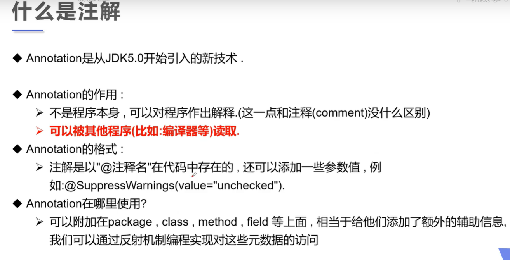
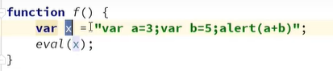
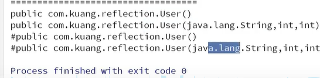

##注解

#### 入门

+ JDK 5.0引入的技术

+ 对程序进行解释    给机器看  可以被其他程序（编译器）读取

  

#### 内置注解

+ @Overried    重写方法申明

+ @Deprecated      不鼓励使用   但是可以使用

+ @SuppressWarnings           抑制警告   可以放在类上

  


#### 元注解

负责注解其他的注解

+ @Target          描述注解适用范围

+ @Retention         生命周期     sources   <   class    <      runtime

+ @Documented              包含在javadoc中

+ @Inherited               可以继承

  
  
  

#### 自定义注解

```java
//定义注解
@Target(value = ElementType.METHOD)     //只能用在方法上  参数数组 {A,B,C}
public @interface MyAnnotation{
    //注解参数
    String name () default "";         //value  才可以省略
}
```


## 反射

 使得 java  具有动态

+ 静态语言      Java（准动态   增加不安全性）     C++    C

+ 动态语言     PHP    JavaScript     Python      运行时改变自身结构

  

#### java反射机制


#### Class 类与获取Class实例

+ 主要API

  + java.lang.Class     代表一个类
  + java.lang.reflect.Method
  + java.lang.reflect.Field    类的成员变量
  + java.lang.reflect.Constructor

  

+ 一个类在内存中只有一个class对象

+ 一个类在被加载后  类的整个结构都会被封装在Class对象中   

##### Class类常用方法


#####获得Class的几种方式 


+ Class class = Person.class    通过具体的类
+ Class class =  person.getClass   通过某个类的实例
+ Class class = Class.forName("com.wxk.Person")   全类名   
+ (内置基本数据类型).Type   
+ ClassLoader     c1.getSuperClass()


#####那些类型有Class对象


+ 只要元素类型与维度一样     就是同一个Class


#### 类的加载与ClassLoader

##### 类加载内存分析


+ 堆
+ 栈
+ 方法区    特殊的堆

##### 类的加载过程

当程序主动使用到某个类时，如果该类还未被加载到内存中        进行初始化     3步

+ 加载：	将类的class文件读入内存   并为之创建一个java.lang.Class对象        由类加载器完成

+ 链接：    类的二进制数合并到JRE中

+ 初始化    JVM 负责对类初始化

  


##### 分析类的初始化

+ 主动引用

+ 被动引用

  

+ test

  

  + 主动引用

  

  

  ​	

  

  

  + 被动   

    

    

    

    

    

    

##### 类加载器


+ 引导类加载器     rt.jar      C++   JVM  自带

  

+ 扩展类加载器     jre/lib/ext

  

+ 系统类加载器    


+ 获得类加载器

  


##### 双亲委派机制

先找根加载器加载


#### 获取运行时类的对象

new   +  clone  +  反射





####调用运行时类的指定结构


##### 创建 

+ 无参构造     newInstance


+ 获得构造器  （当没有无参构造时）

  

+ 调用方法  invoke（对象，参数）

  

+ 操作属性     private  报错

  

  + 关闭权限检测

    

##### 性能对比

+ 普通方法       9ms

  

+ 反射         5699ms

  

+ 反射  关闭检测    1959ms

  

#### 反射操作泛型


#### 获取注解信息


+ 创建注解

  

  


+ 操作

  


