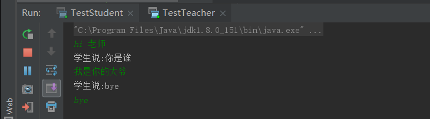

## 网络编程

#### 计算机网络

+ 信件

  

+ 打电话      TCP

+ 发短信       UDP

+ 地理位置不同的计算机+外部设备     网络通信协议    资源共享   信息传递

+ 如何定位网络上的一台主机         ip+端口

+ 找到主机后     如何传输数据

#### 网络通信

##### 如何实现

+ 通信双方地址     ip+port
+ 规则       协议   UDP    TCP

##### TCP/IP网络模型


#### IP地址

IP地址：InetAddress

- 唯一定位一台网络上的计算机

- 127.0.0.1：本机localhost

- ip地址分类

  - ipv4/ipv6：

    - ipv4 4个字节，每个字节0~255，共42亿，30亿在北美

    - ipv6 128位，8个无符号整数。

      2001：2001：2001：2001：2001：2001：2001：2001

  - 公网/私网

    - ABCDE类地址
    - 192.168.xx.xx,专门给组织内部使用（局域网）

- 域名       记忆IP

```java
public class IPTest {

    public static void main(String[] args) {
        try {
            //InetAddress inetAddress1=InetAddress.getByName("127.0.0.1");
            //InetAddress inetAddress1=InetAddress.getByName("localhost");
            InetAddress inetAddress1=InetAddress.getLocalHost();
            InetSocketAddress socketAddress=new InetSocketAddress("127.0.0.1",8080);
            System.out.println(socketAddress.getHostName());
            System.out.println(inetAddress1);
            //查询网站地址
            InetAddress inetAddress2=InetAddress.getByName("www.baidu.com");
            System.out.println(inetAddress2);
        } catch (UnknownHostException e) {
            // TODO Auto-generated catch block
            e.printStackTrace();
        }
    }
}
```

#### 端口port

表示计算机上程序的进程

+ 不同的进程不同端口号
+ 0~65535
+ TCP:UDP 65535*2，单个协议下，端口不能冲突
+ 端口分类
  + 公有端口，尽量不要占用：0~1023
    + https:443
    + http:80
    + ftp:21
    + telent:23
  + 程序注册端口：1024-49151，分配用户或者程序
    + Tomcat：8080
    + MySQL:3306
    + Oracle:1521
      -动态私有端口：49152-65535

```java
import java.net.InetSocketAddress;

public class PortTest {

    public static void main(String[] args) {
        InetSocketAddress inetSocketAddress = new InetSocketAddress("127.0.0.1", 8080);
        System.out.println(inetSocketAddress);     ///127.0.0.1:8080

        InetSocketAddress inetSocketAddress1 = new InetSocketAddress("localhost", 8080);
        System.out.println(inetSocketAddress1);     ///localhost/127.0.0.1:8080

        System.out.println(inetSocketAddress.getAddress());
        System.out.println(inetSocketAddress.getHostName());

    }
}
```

```java
netstat -ano#查看所有端口
netstat -ano|findstr "5900"     #参看指定的端口
tasklist|finderstr “8696”       #查看指定端口的进程
```

#### 通信协议

+ 协议     约定        说话    =>   普通话
+ TCP      用户传输协议
+ UDP     用户数据报协议

##### TCP/IP协议族

​		实质：一组协议

##### TCP

打电话

+ 三次握手 四次挥手，面向连接相对稳定

  

  + 三次握手

  

  + 四次挥手

  

- 客户端
  - 连接服务器Socket
  - 发送消息
- 服务器
  - 建立服务端口ServerSocket
  - 等待用户的连接accept
  - 接受用户的消息

##### UDP

发短信

- 不用建立连接，但是需要地址    不稳定
- 客户端      服务端    没有明确的界限
- DDOS     洪水攻击、饱和攻击

|        | tcp          | udp            |
| ------ | ------------ | -------------- |
| 服务端 | ServerSocket | DatagramSocket |
| 客户端 | Socket       | DatagramSocket |

#### TCP实现聊天

+ 客户端

  ```java
  package com.wxk.net;
  
  import java.io.IOException;
  import java.io.OutputStream;
  import java.net.InetAddress;
  import java.net.Socket;
  
  public class TcpClientTest01 {
  
      public static void main(String[] args) {
          Socket socket = null;
          OutputStream os = null;
          try {
              //1.准备要链接的服务端的信息
              InetAddress addresses = InetAddress.getByName("127.0.0.1");
              int port = 9999;
  
              //2.创建套接字对象链接
              socket = new Socket(addresses, port);
  
              //3.发送消息      IO流   发送消息     输出流 
              os = socket.getOutputStream();
              os.write("你好，欢迎学习狂神说Java".getBytes());
          } catch (Exception e) {
              e.printStackTrace();
          } finally {
              if(os != null) {
                  try {
                      os.close();
                  } catch (IOException e) {
                      e.printStackTrace();
                  }
              }
  
              if(socket != null) {
                  try {
                      socket.close();
                  } catch (IOException e) {
                      e.printStackTrace();
                  }
              }
          }
      }
  }
  ```

+ 服务器

  ```java
  package com.wxk.net;
  
  import java.io.ByteArrayOutputStream;
  import java.io.IOException;
  import java.io.InputStream;
  import java.net.ServerSocket;
  import java.net.Socket;
  
  public class TcpServerDemo1 {
  
      public static void main(String[] args) {
          ServerSocket server = null;
          Socket socket = null;
          InputStream is = null;
          ByteArrayOutputStream baos = null;
          try {
              //1.ip为服务器本机地址。  创建一个服务 设定端口号即可
              server = new ServerSocket(9999);
              //循环监听   
              while(true) {
                  //2.等待客户端链接
                  socket = server.accept();
  
                  //3.读取客户端发送的消息        接受消息    
                  is = socket.getInputStream();
  
                  //管道流    
                  baos = new ByteArrayOutputStream();
                  byte[] bytes = new byte[1024];
                  int len;
                  while((len=is.read(bytes))!= -1) {
                      baos.write(bytes, 0, len);
                  }
                  System.out.println(baos.toString());
              }
  
          } catch (Exception e) {
              e.printStackTrace();
          } finally {
              if(baos != null) {
                  try {
                      baos.close();
                  } catch (IOException e) {
                      e.printStackTrace();
                  }
              }
              if(is != null) {
                  try {
                      is.close();
                  } catch (IOException e) {
                      e.printStackTrace();
                  }
              }
              if(socket != null) {
                  try {
                      socket.close();
                  } catch (IOException e) {
                      e.printStackTrace();
                  }
              }
              if(server != null) {
                  try {
                      server.close();
                  } catch (IOException e) {
                      e.printStackTrace();
                  }
              }
          }
      }
  }
  ```

+ test    先启动Server


- 客户端
  - 连接服务器Socket
  - 发送消息
- 服务器
  - 建立服务端口ServerSocket
  - 等待用户的连接accept
  - 接受用户的消息

#### TCP文件上传

+ 客户端

  ```java
  package com.wxk.net;
  
  import java.io.*;
  import java.net.InetAddress;
  import java.net.Socket;
  
  public class TcpClientTest02 {
  
      public static void main(String[] args) throws Exception {
          //创建socket链接
          Socket socket = new Socket(InetAddress.getByName("127.0.0.1"), 9000);
          //创建输出流
          OutputStream outputStream = socket.getOutputStream();
  
          //文件流
          FileInputStream fileInputStream = new FileInputStream(new File("E:\\workspace\\Network_program\\wxk.png"));
  
          //写出文件
          byte[] buffer = new byte[1024];
          int len = 0;
          while((len = fileInputStream.read(buffer))!=-1){
              outputStream.write(buffer,0,len);
          }
  
          //通知服务器结束
          socket.shutdownOutput();
  
          //确定服务器接受完成   断开连接
          InputStream inputStream = socket.getInputStream();
  
          ByteArrayOutputStream byteArrayOutputStream = new ByteArrayOutputStream();
          byte[] buffer1 = new byte[1024];
          int len1 = 0;
          while((len1 = inputStream.read(buffer1))!=-1){
              byteArrayOutputStream.write(buffer1,0,len1);
          }
          System.out.println(byteArrayOutputStream.toString());
  
          //关闭资源
          byteArrayOutputStream.close();
          inputStream.close();
          fileInputStream.close();
          outputStream.close();
          socket.close();
  
      }
  
  }
  ```

+ 服务器

  ```java
  package com.wxk.net;
  
  import java.io.File;
  import java.io.FileOutputStream;
  import java.io.InputStream;
  import java.io.OutputStream;
  import java.net.ServerSocket;
  import java.net.Socket;
  
  public class TcpServerTest02 {
  
      public static void main(String[] args) throws Exception {
          //创建服务
          ServerSocket serverSocket = new ServerSocket(9000);
  
          //阻塞式监听客户端连接
          Socket socket = serverSocket.accept();
  
          //获取输入流
          InputStream inputStream = socket.getInputStream();
  
          //文件输出
          FileOutputStream fileOutputStream = new FileOutputStream(new File("E:\\workspace\\Network_program\\receive.png"));
  
          byte[] bytes = new byte[1024];
          int len;
          while((len = inputStream.read(bytes))!= -1) {
              fileOutputStream.write(bytes, 0, len);
          }
  
  
          //通知客户端  接受完毕
          OutputStream outputStream = socket.getOutputStream();
          outputStream.write("我接受完毕了  你可以断开了".getBytes());
  
          //关闭资源
          fileOutputStream.close();
          inputStream.close();
          socket.close();
          serverSocket.close();
  
      }
  }
  ```

+ test

  

#### 初识Tomcat

+ 服务端      Tomcat
+ 客户端       浏览器

#### UDP消息发送

+ 无客户端   服务端  概念

+ 不用建立连接，但是需要地址

+ 发送方   （先启动 UdpClientTest01  不会报错 ）

  ```java
  package com.wxk.net;
  
  import java.net.DatagramPacket;
  import java.net.DatagramSocket;
  import java.net.InetAddress;
  
  //不需要连接服务器
  public class UdpClientTest01 {
  
      public static void main(String[] args) throws Exception {
          //建立Socket
          DatagramSocket socket=new DatagramSocket();
  
          //打包数据包
          String msg="hello   服务器";
          new DatagramPacket(msg.getBytes(),0,msg.getBytes().length);
          //发送   服务器地址
          InetAddress address=InetAddress.getByName("127.0.0.1");
          int post=9090;
          DatagramPacket packet=new DatagramPacket(msg.getBytes(),0,msg.getBytes().length,address,post);
  
          socket.send(packet);
          socket.close();
      }
  }
  ```

+ 接收方

  ```java
  package com.wxk.net;
  
  
  import java.net.DatagramPacket;
  import java.net.DatagramSocket;
  //服务器端,等待客户端的数据包
  public class UdpServerTest01 {
  
      public static void main(String[] args) throws Exception{
          //开放端口
          DatagramSocket socket=new DatagramSocket(9090);
          //接受数据包
          byte[] buffer=new byte[1024];
          DatagramPacket packet=new DatagramPacket(buffer,0,buffer.length);
          socket.receive(packet);//阻塞接受
          System.out.println(new String(packet.getData()));
          //关闭连接
          socket.close();
      }
  }
  ```

#### UDP聊天

+ 发送方循环发送消息

  ```java
  package com.wxk.net.udpchat;
  
  import java.io.BufferedReader;
  import java.io.InputStreamReader;
  import java.net.DatagramPacket;
  import java.net.DatagramSocket;
  import java.net.InetSocketAddress;
  
  public class UdpSenderTest01 {
  
      public static void main(String[] args) throws Exception{
          //建立Socket
          DatagramSocket socket=new DatagramSocket(8888);
  
          //准备数据
          BufferedReader reader = new BufferedReader(new InputStreamReader(System.in));
  
          //循环发送
          while(true){
              String data = reader.readLine();
              byte[] datas = data.getBytes();
              DatagramPacket packet = new DatagramPacket(datas,0,datas.length,new InetSocketAddress("localhost",6666));
  
              if(data.equals("bye"))
                  break;
              socket.send(packet);
          }
          socket.close();
      }
  }
  ```

+ 接收方循环接受

  ```java
  package com.wxk.net.udpchat;
  
  import java.net.DatagramPacket;
  import java.net.DatagramSocket;
  
  
  public class UdpReceiveTest01 {
  
      public static void main(String[] args) throws Exception {
          //建立Socket
          DatagramSocket socket=new DatagramSocket(6666);
  
  
          while(true) {
              //准备接受数据
              byte[] container = new byte[1024];
              DatagramPacket packet = new DatagramPacket(container, 0, container.length);
              socket.receive(packet);    //阻塞式接受
              //断开连接
              byte[] data = packet.getData();
              String receiveDatas = new String(data, 0, data.length);
              System.out.println(receiveDatas);
              if (receiveDatas.equals("bye")) {
                  socket.close();
                  break;
              }
          }
          socket.close();
      }
  }
  ```

+ test

  

#### UDP多线程在线咨询

+ 多线程

+ 不分发送方接收方

+ 发消息的类

  ```java
  package com.wxk.net.udpchat;
  
  import java.io.BufferedReader;
  import java.io.IOException;
  import java.io.InputStreamReader;
  import java.net.DatagramPacket;
  import java.net.DatagramSocket;
  import java.net.InetAddress;
  import java.net.SocketException;
  
  public class TalkSend implements Runnable {
      DatagramSocket socket = null;
      BufferedReader br = null;
  
      private String toIP;
      private int toPort;
  
      public TalkSend(String toIP, int toPort) {
          this.toIP = toIP;
          this.toPort = toPort;
          try {
              socket = new DatagramSocket();//准备链接
              br = new BufferedReader(new InputStreamReader(System.in));//接收控制台输入
          } catch (SocketException e) {
              e.printStackTrace();
          }
      }
  
      @Override
      public void run() {
          while(true) {
              //准备数据包
              byte[] data = new byte[0];
              try {
                  data = br.readLine().getBytes();
                  DatagramPacket packet = new DatagramPacket(data, 0, data.length, InetAddress.getByName(this.toIP), this.toPort);
  
                  //发送包
                  socket.send(packet);
              } catch (Exception e) {
                  e.printStackTrace();
              }
              String msg = new String(data,0,data.length);
              if(msg.equals("bye")) {
                  break;
              }
          }
  
          //关闭链接
          try {
              br.close();
              socket.close();
          } catch (IOException e) {
              e.printStackTrace();
          }
      }
  }
  ```

+ 收消息的类

  ```java
  package com.wxk.net.udpchat;
  
  import java.io.IOException;
  import java.net.DatagramPacket;
  import java.net.DatagramSocket;
  import java.net.SocketException;
  
  public class TalkRecieve implements Runnable{
      DatagramSocket socket = null;
      private String name;
  
      public TalkRecieve(int fromPort, String name) {
          try {
              this.name = name;
              this.socket = new DatagramSocket(fromPort);//准备链接
          } catch (SocketException e) {
              e.printStackTrace();
          }
      }
  
      @Override
      public void run() {
          try {
              while(true) {
                  //准备容器
                  byte[] container = new byte[1024];
                  DatagramPacket packet = new DatagramPacket(container, 0, container.length);
                  socket.receive(packet);//阻塞式接收
  
                  String s = new String(packet.getData(), 0, packet.getData().length);
                  System.out.println(name + ":" +s);
  
                  if(s.equals("bye")) {
                      break;
                  }
              }
          } catch (IOException e) {
              e.printStackTrace();
          }
          //关闭资源
          socket.close();
      }
  }
  ```

+ 模拟启动一个老师

  ```java
  package com.wxk.net.udpchat;
  
  public class TestTeacher {
      public static void main(String[] args) {
          new Thread(new TalkSend("127.0.0.1", 8888)).start();//发送消息
          new Thread(new TalkRecieve(7777, "学生说")).start();//接收消息
      }
  }
  ```

+ 模拟启动一个学生

  ```java
  package com.wxk.net.udpchat;
  
  public class TestStudent {
      public static void main(String[] args) {
          new Thread(new TalkSend("127.0.0.1", 7777)).start();//发送消息
          new Thread(new TalkRecieve(8888, "老师说")).start();//接收消息
      }
  }
  ```

+ test

+ 

#### URL下载网络资源


```java
package com.wxk.net;


import java.io.FileOutputStream;
import java.io.InputStream;
import java.net.HttpURLConnection;
import java.net.URL;

public class UrlTest {

    public static void main(String[] args) throws Exception {
        URL url = new URL("http://localhost:8080/examples/index.html");

        HttpURLConnection connection = (HttpURLConnection)url.openConnection();

        InputStream is = connection.getInputStream();

        FileOutputStream fos = new FileOutputStream("E:\\workspace\\Network_program\\copyhtml.html");

        byte[] bytes = new byte[1024];
        int len;
        while((len = is.read(bytes)) != -1) {
            fos.write(bytes,0,len);
        }

        fos.close();
        is.close();
        connection.disconnect();
    }
}
```

+ 下载成功

