## 计算机基础

### 汇编语言入门

#### 语言

人与人之间的语言     -->     计算机的语言

+ 机器语言   0/1

  ```shell
  ###主流
  0/1
  #穿孔卡带           +-/*   本质加法
  加: 0100 0000
  减: 0100 1000
  乘: 0100 0000  0100 0000
  除: 0100 0000  1100 1000
  
  #助记符号    <=> 汇编语言
  ```

+ 汇编语言

  ```shell
  +:  INC     -编译器->   +: 0100 0000
  -:  DEC                -: 0100 1000
  *:  MUL                *: 0100 0000  0100 0000
  /:  DIV                /: 0100 0000  1100 1000 
  
  #用于底层的编写    单片机
  ```

+ C语言

  ```shell
  加: +        -编译器->    +: 0100 0000
  减: -					-: 0100 1000
  乘: *					*: 0100 0000  0100 0000
  除: /					/: 0100 0000  1100 1000 
  ```

  

#### 进制

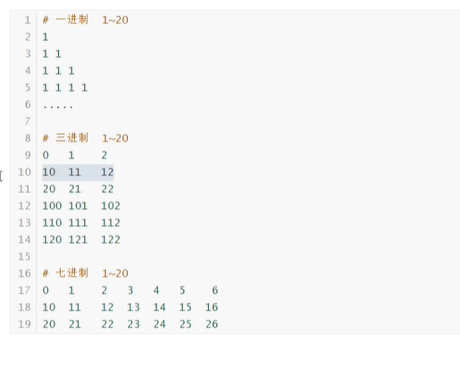

本质：一组定义的符号    逢几进几            <=>   ==进制加密==

##### 进制运算

+ 十进制   2 + 3

+ 八进制   

  ```shell
  ##八进制运算    本质查数
  
  ## 0 1 2 3 4 5 6 7   11 12 13 14 15 16 17  20 21 22 23 24 25 26 27 
  
  2+3   = 5    ##2后走3
  2*3   = 6
  4+5   = 11
  4*5   = 24   往后数数
  
  ###进位与计算表
  277+333   
  276*54
  237-54
  234/4
  ```

  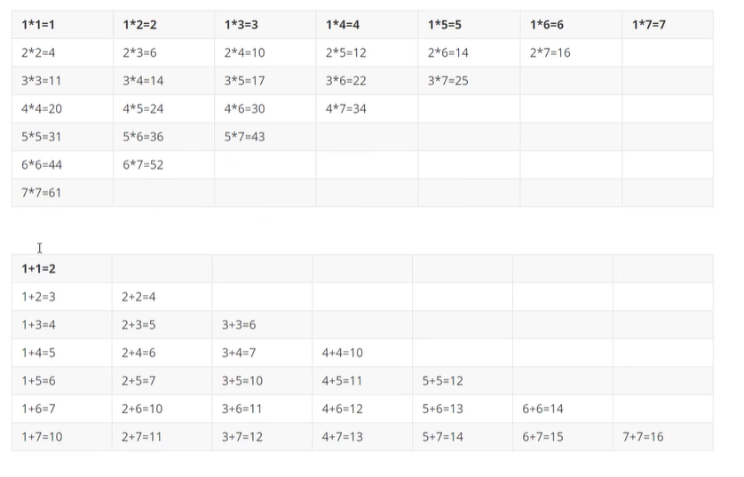

  ​	**列表计算：**

  ```    shell
  277                
  333 +
  --------
  632
  
  
  			276
  			 54    *
  	-----------------
  		   1370
  		  1666      +
     ------------------
     		  20250
     		  
     		  
    234
    	4    /本质*      4*？接近2/23
   -------
   	47
  ```

  ​	

##### 二进制

+ 电子计算机       电子  高低电平   集成电路   硅晶片                 

+ 物理极限：摩尔定律

  语言极限：并发语言     	如何突破本质瓶颈   **量子计算机**：（传道），使用量子计算   ，提高计算能力

+ 量子计算机    昆比特      量子的两态   

  光子：正交偏振方向

  磁场：电子自旋方向       ==200秒完成目前计算机1万年进行的运算量==

**二进制简写    =>    十六进制**    

```shell
#二进制    0  -  1111
0  1  10  11 100  101  110  111  1000  1001  1010  1011  1100  1101  1110  1111
0  1  2   3   4    5    6    7     8    9      a     b    c      d     e    f 
```

##### 数据宽度

+ 数学上：         内存有限制      给数据添加宽度    bit     0/1  ->  byte   0-0xFF  ->  word   0-0xFFFF  ->     Dword    0-0xFFFFFFFFF
+ 定义数据类型   <=>  定义数据宽度          强类型  ：C    C++    java

##### 有符号、无符号数

+  每个数据代表啥意思  10011010  

+  规则

  + 无符号数规则

    ```shell
    10011010    16进制:  0x9A      10进制：154
    ```

  + 有符号数规则   

    ```shell
    #最高位  1负数  0 正数 
    10011010 ？？？
    ```

#### 原码补码反码

##### 原码

+ 最高位符号位      

##### 反码

+ 正数     与原码相同 

+ 负数：符号位1       其余位对原码取反

#####补码

+ 正数     与原码相同 

+ 负数：符号位1       反码+1 

```shell
1
#原码    0000  0001
#反码    0000  0001
#补码	   0000  0001

—1
#原码    1000  0001
#反码    1111  1110
#补码	   1111  1111
```

#### 位运算

+ 寄存器    mvn   寄存器  值

  ​		mvn eax 1

  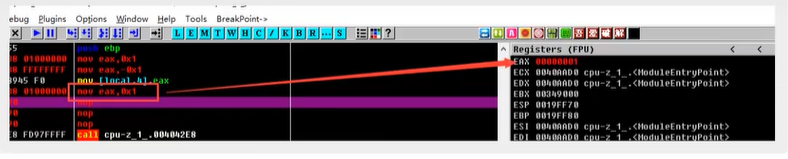

  ​		mvn eax  -1   （补码方式）

  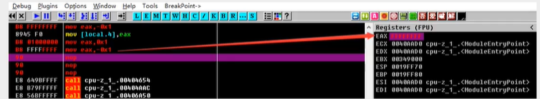

  

+ 与或非运算

+ 位运算

  + 2*8的最高效计算方式    汇编命令少
  + 左移   <<    高位丢弃    低位补0
  + 右移   >>    低位丢弃     高位根据符号位确定

+ 位运算实现加减乘除

  计算机只认识   01         基本数学建立在加减乘除

  + 加

    ```shell
    #4+5
    
    0000 0100
    0000 0101   +
    -----------    
    0000  1001  
    
    #计算机的实现原理
    #1.异或   不考虑进位  最终结果
    0000 0100
    0000 0101   
    -----------    
    0000 0001 
    
    #2.与运算 判断进位    结果为0   =>  无进位
    0000 0100
    0000 0101   
    -----------    
    0000 0100
    
    #3.与运算结果左移   
    0000 0100
    ----------
    0000 1000
    
    #4.异或   
    0000 1000
    0000 0001 
    -----------
    0000 1001
    
    #5 与运算     判断进位
    0000 1000
    0000 0001
    ----------
    0000 0000
    
    # 结果为4的结果
    
    ```

  + 减

    ```shell
    4-5
    
    4+(-5)   
    0000  0100
    1111  1011  +				5:0000 0101   =>  -5补码1111  1010  +1   =>     1111  1011
    -----------
    1111  1111       ff   -1
    ```

  + 乘

    ```shell
    #多个加法
    ```

  + 除 

    ```shell
    #多个减法    x/y   x能减多少个y
    #计算机只会做加法
    ```

==计算机本质：机器语言就是位运算     都是通过电路来实现==

#### 汇编学习

##### 汇编语言

+ 通过指令  代替二进制编码     ADD指令   转化为二进制操作

  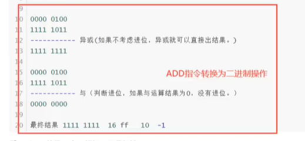

+ 理解底层汇编     

  + 环境配置    VC 6   C++     程序  => 汇编
  + OD   反汇编
  + 抓包工具
  + 加密解密工具

  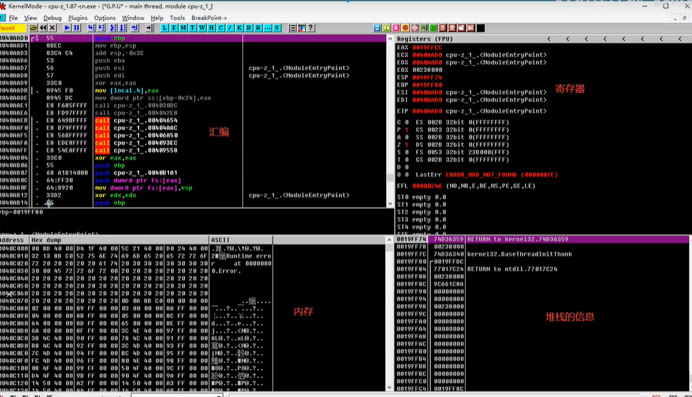

+ 目的    理解程序的本质  

+ 外挂     修改内存地址的值

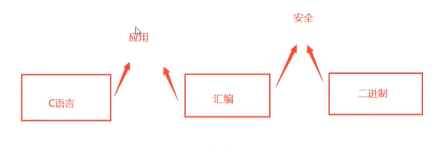


王爽《汇编语言》  16位                       32位-> 64位    寻址能力增加

可以直接学习32位

#####寄存器

+ 存储数据     CPU  >   内存  >  硬盘

  + 32  CPU   支持  8  16  32  位寄存器   
  + 64  CPU   支持  8  16  32  64  位寄存器  

+ 通用寄存器   一般写值

  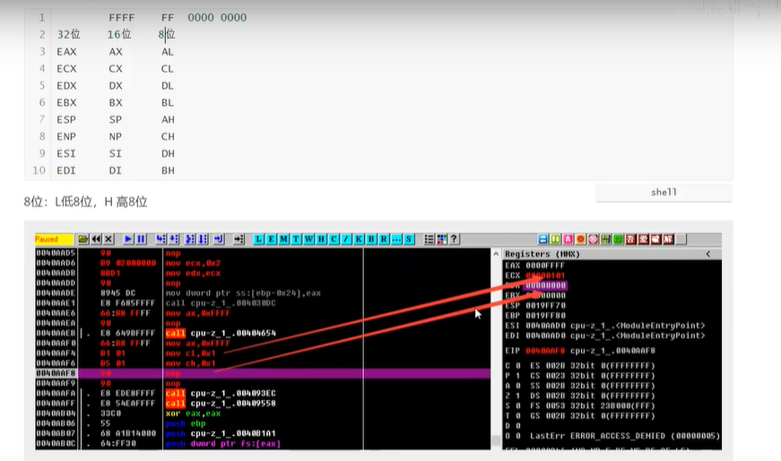

  + 如何存值       二进制直接修改     /     mov指令（数字写入到寄存器      寄存器到寄存器）

+ 其他寄存器    每一位都有其功能

#####内存

寄存器小，数据不够用  

+ 作用     每个应用程序  都有4GB内存空间     空头支票

  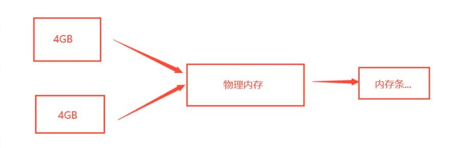

+ 程序真正运行   才会用到物理内存

+ 1B = 8bit        1KB = 1024B      4G = 4x1024x1024x8     计算机内存地址很多    空间大

+ 每个空间分配一个地址   名称   ==内存地址==         32位     8个F   

  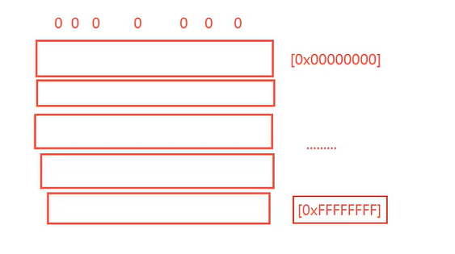

+ 32位    寻址能力      4GB

  ```shell
  #32位能存的最大值    FFFFFFFF+1  = 100000000
  
  #位如何限制内存大小？
  内存地址存8位      可以存  800000000  个0/1     2进制 ：34359738368bit  =>   /8  :  4 294 967 296字节  
  									/1024/1024/1024:   4GB
  ```

+ 每个内存地址都有一个编号    通过编号存值

+ 不是每个内存地址都可以写     需要申请内存

  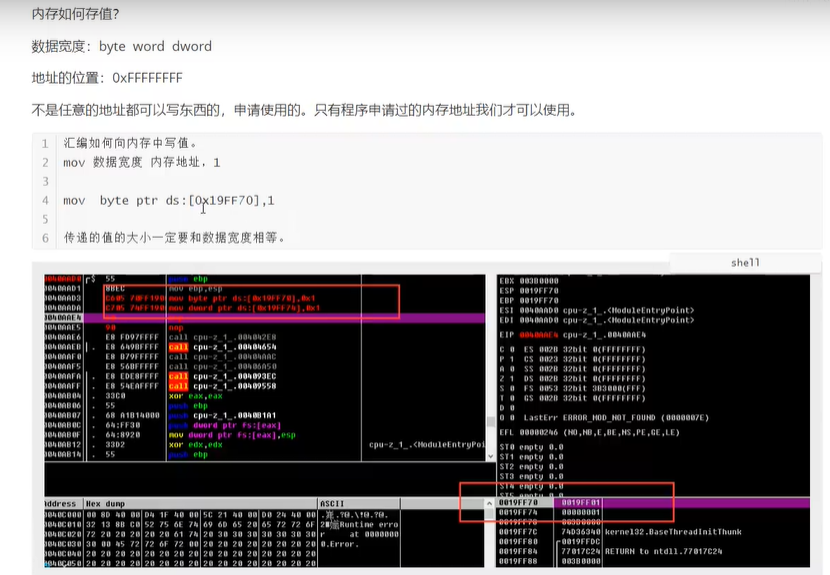

+ 内存地址有多种写法

  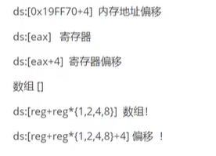

#####==后续==汇编指令

##### 内存复制

##### 堆栈指令

##### 堆栈平衡

#####外挂

### 汇编高级

#### ==待续：操作系统内核==

### 计算机网络

###计算机操作系统

### 计算机组成原理


