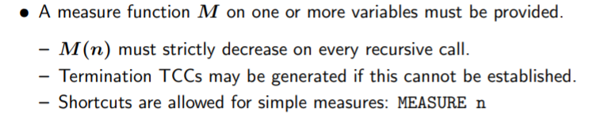
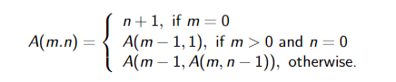
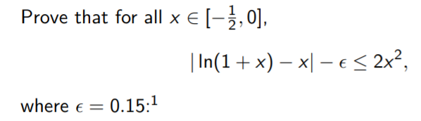

##DAY01:

### Introduction to Formal Methods

####State-machine Specifification

    next_state(ev, current_state, new_mode): ALTSEL_submodes =
    	COND
    		new_mode = ALTHOLD -> CLEARED,
    	
        	new_mode = ALTSEL AND
    		ARMED?(ALTSEL(current_state)) AND
    		ALTSEL_Cond_Capture?(ev) -> CAPTURE,
    
    		new_mode = ALTSEL AND
    		ALTSEL_Cond_Track?(ev) -> TRACK,
    
    		new_mode /= ALTHOLD AND
    		new_mode /= ALTSEL -> ARMED
    
    		ELSE -> ALTSEL(current_state)
    	ENDCOND


####航班数据管理    

```pvs
flight_sched: THEORY
BEGIN
    N : TYPE+    % flight numbers
    S : TYPE+    % schedules
    D : TYPE = [N -> S]    % flight database
    
    u0: S      % unscheduled
    
    S_good: TYPE = {sched: S | sched /= u0}
    
    flt : VAR N
    d : VAR D
    sched : VAR S_good
    
    emptydb(flt): S = u0
    
    find_schedule(d, flt): S = d(flt)
    
    scheduled?(d,flt): boolean = d(flt) /= u0
    
    add_flight(d, flt, sched): D =
   		 IF scheduled?(d,flt) THEN d
    	 ELSE d WITH [flt := sched] ENDIF
    	 
    change_flight(d, flt, sched): D =
   		 IF scheduled?(d,flt) THEN d WITH [flt := sched]
   		 ELSE d ENDIF
   		 
    delete_flight(d, flt): D = d WITH [flt := u0]
    
    putative2: LEMMA NOT scheduled?(d,flt) IMPLIES
    		delete_flight(add_flight(d,flt,sched),flt) = d
    		
    SchedAdd : LEMMA scheduled?(add_flight(d,flt,sched),flt)
    
END flight_sched
```

### PVS in a Hurry

```
pvs_hurry: THEORY
BEGIN

  % Challenge 1: Prove 2+2=4
  name1: LEMMA 2+2=4
 
 
  % Challenge 2: Prove that for all real numbers x, x^2 >= 0
  squared_nonnegative: LEMMA FORALL (x:real): x^2 >= 0


  % Challenge 3: Prove that two aircraft do not hit.
  position1: VAR real
  position2: VAR real
  speed1,speed2: VAR posreal

  t: VAR posreal
  
  position_at(position1,speed1,t): real =
    position1 + t*speed1

  hit?(position1,speed1,position2,speed2): bool =
    EXISTS (t): position_at(position1,speed1,t) = 
    	   	position_at(position2,speed2,t)

  do_not_hit: LEMMA
    position1 < position2 % aircraft 1 is originally behind aircraft 2
    AND speed1 < speed2   % it is also moving slower
    IMPLIES
    NOT hit?(position1,speed1,position2,speed2)


  % Challenge 4: Prove that x^2 < y^2 whenever x and 
  %                  y are positive and x < y.
  squared_increasing: LEMMA FORALL (x,y:posreal):
            x < y IMPLIES x^2 < y^2


% Challenge 5: prove that the cardinality of the powerset of
  %  {0,1,...,10} is 2^11.
  % Use the libraries:

  IMPORTING sets_aux@power_sets

  set_below_11: finite_set[nat] = {n:nat | n < 11}
  card_below_11: LEMMA card(powerset(set_below_11)) = 2^11

  % The proof uses the command '(grind)', which applies (assert)
  % and a bunch of other stuff. It expands definitions, applies
  % rewriting, and uses (assert) to apply decision procedures.

  % The proof is:
  % (lemma "card_powerset[nat]")
  % (inst - "set_below_11")
  % (replace -1)
  % (hide -1)
  % (case "card(set_below_11) = 11")
  % (("1" (assert))
  %  ("2"
  %   (hide 2)
  %   (typepred "card(set_below_11)")
  %   (lemma "Card_bijection[nat]")
  %   (inst - "set_below_11" "11")
  %   (assert)
  %   (inst + "LAMBDA (i:{n:nat | n < 11}): i")
  %   (("1" (hide-all-but 1) (grind)) ("2" (hide-all-but 1) (grind)))))
  
end pvs_hurry
```
 ###Declarations and Types in the PVS Specification Language

####Declarations

```
    seconds_per_hour: nat = 3600
    minute: TYPE = {m: nat | m < 60}
    before, after: VAR minute
```

####Kinds of Declarations

- Type declaration

- Variable declarations
- Constant declarations
- **Recursive definitions**
- Formula declarations

- Judgements

####Theories

```
My_Theory [<parameters>]: THEORY
BEGIN
    <assuming part>
    <declaration>
        .
        .
        .
    <declaration>
END My_Theory
```

####Enumeration Types

```
color: TYPE = {red, white, blue}
flight_mode: TYPE = {going_up, going_down}
```

####Function Types

```
status: TYPE = [LRU_id -> bool]
operator: TYPE = [int, int -> int]
operator: TYPE = FUNCTION[int, int -> int]
control_bank: TYPE = ARRAY[LRU_id -> control_block]
```

####More on Predicates and Types

- A predicate type can be declared explicitly or using a shorthand

  ```
  nat_pred: TYPE = [nat -> bool]
  nat_pred: TYPE = pred[nat]
  nat_pred: TYPE = setof[nat]
  ```

-  Predicate subtypes also can be specified using a shorthand:

  ```
  prime?(n: nat): bool = ...
  primes: TYPE = {n: nat | prime?(n)}
  primes: TYPE = (prime?)
  ```

####Tuple Types

```
pair: TYPE = [int, int]
position: TYPE = [real, real, real]
two_bits: TYPE = [bool, bool]
```

####Record Types

```
pair: TYPE = [# left: int, right: int #]
vector: TYPE = [# x: real, y: real, z: real #]
ctl_block: TYPE = [# active: bool, timestamp: TOD, status: op_mode #]

Instances:
	(# x := 1, y := 2, z := 3 #)
	(# left := 1, right := 2 #) = (# right := 2, left := 1 #)
```

####Other Type Concepts

- Abstract data types

  ```
  list[base: TYPE]: DATATYPE
      BEGIN
          null: null?
          cons (car: base, cdr: list) : cons?
      END list
  ```

- Dependent types

   ```
  date1: TYPE = [ yr: year, mon: month,
  				{d: posnat | d <= days(mon, yr)} ]
  date2: TYPE = [# yr: year, mon: month,
  				day: {d: posnat | d <= days(mon, yr)} #]
  ```

####Examples of Declarations


```
vectors [index_type: TYPE]: THEORY
BEGIN

    vector: TYPE = [index_type -> real]
    
    i,j,k: VAR index_type
    a,b,c: VAR real
    U,V: VAR vector
    
    zero_vector: vector = LAMBDA i: 0
    vector_sum(U, V): vector = LAMBDA i: U(i) + V(i)
    vector_diff(U, V): vector = LAMBDA i: U(i) - V(i)
    scalar_mult(a, V): vector = LAMBDA i: a * V(i)
	. . .
END vectors

```

```
matrices [row_type, col_type: TYPE]: THEORY
BEGIN

    vector: TYPE = [col_type -> real]
    matrix: TYPE = [row_type -> vector]
    
    vector_2: TYPE = [row_type -> real]
    matrix_2: TYPE = [col_type -> vector_2]
    
    i:		 VAR row_type
    j: 		 VAR col_type
    a,b,c:	 VAR real
    U,V: 	 VAR vector
    M,N:	 VAR matrix
    . . .
END matrices
```


```
major_mode_code:     TYPE = nat
mission_time:        TYPE = real
GPS_id:			     TYPE = {n: nat | 1 <= n & n <= 3}
receiver_mode:		 TYPE = {init, test, nav, blank}
AIF_flag: 			 TYPE = {auto, inhibit, force}
M50_axis:			 TYPE = {Xm, Ym, Zm}

IMPORTING vectors[M50_axis]

M50_vector: 		TYPE = vector[M50_axis]
position_vector: 	TYPE = M50_vector
velocity_vector: 	TYPE = M50_vector
GPS_predicate: 		TYPE = [GPS_id -> bool]
GPS_positions: 		TYPE = [GPS_id -> position_vector]
GPS_velocities: 	TYPE = [GPS_id -> velocity_vector]
GPS_times: 			TYPE = [GPS_id -> mission_time]
```


### Expression Language Features of PVS

####Equality Relations

略

####Arithmetic Expressions

略

####Logical Expressions and Formulas

略

####==Conditional Expressions==

```
IF x < 0 THEN -1 ELSIF x = 0 THEN 0 ELSE 1 ENDIF

COND 
	m = n -> n,
    m > n -> gcd(m - n, n),
    m < n -> gcd(m, n - m)
ENDCOND
```

####Tabular Expressions

```
TABLE %---------------------------------------------%
    |[ m = n   | m > n         | m < n ]       |
    %---------------------------------------------%
    | n        | gcd(m - n, n) | gcd(m, n - m) ||
    %---------------------------------------------%
ENDTABLE
```

#### Function Declaration

- uninterpreted  function declarations

  ```
  abs(x): nat
  max: [int, int -> int]
  ordered(s: num_list): bool
  ```

-  equivalent  declarations

  ```
  gcd: [nat, nat -> nat]
  gcd(m: nat, n: nat): nat
  ```

- interpreted function declarations

  ```
  abs(x): nat = IF x < 0 THEN -x ELSE x ENDIF
  time(m: minute, s: second): nat = m * 60 + s
  device_busy(d: control_block): bool = NOT d‘ready
  scalar_mult(a, V): vector = LAMBDA i: a * V(i)
  ```

#### ==Recursive Function Definitions==

```
factorial(n): RECURSIVE nat =
	IF n = 0 THEN 1 ELSE n * factorial(n-1) ENDIF
MEASURE LAMBDA n: n
```



####Function Application

```
  f(x) a - b     g(y, z)     h(0, f(a)) + 1
  +(x, y)        *(y, -(z, 1))
```

| Function signature         | Possible application |
| -------------------------- | -------------------- |
| f: [nat -> [real -> real]] | f(1)(x)              |
|g: [nat,nat -> [real -> real]]|g(2,3)(f(k)(z))|
|h: [nat,real -> [bool,int -> real]]|h(0, a)(true, 39|

####Function Overriding
```
f WITH [0 := 2, 1 := 3]
f WITH [(0) := 2, (1) := 3]
table WITH [(i) := g(i)]
matrix WITH [(i)(j) := x * y]

(f WITH [(i) := a])(j) =
		IF i = j THEN a ELSE f(j) ENDIF
```
- A form using symbol |-> extends the domain of the function, resulting in a different type

  ```
  f WITH [(-1) |-> g(0)]
  ```


####Lambda Abstraction

```
LAMBDA j: 0
LAMBDA i: table(i)
LAMBDA x,y: x + 2 * y
LAMBDA (p: prime): 2^p - 1

square: [real-> real] = LAMBDA (x: real): x * x
square(x: real): real = x * x
(LAMBDA (p: prime): 2^p - 1)(3) = 7
```

####Record Operations

```
(# ready := true, timestamp := T + 1, count := 0 #)

IF r‘ready  THEN r‘timestamp  ELSE 0 ENDIF    类似r.ready
IF ready(r) THEN timestamp(r) ELSE 0 ENDIF

```

- Record update

  ```
  r WITH [ ready := false,  timestamp := current]
  r WITH [‘ready := false, ‘timestamp := current]
  ```

####Tuple Operations

```
(true, T + 1, 0)

IF t‘1       THEN t‘2       ELSE 0 ENDIF      使用了内置的projection functions 
IF proj_1(t) THEN proj_2(t) ELSE 0 ENDIF
```

- Tuple update

  ```
  t WITH [ 1 := false,  2 := current]
  t WITH [‘1 := false, ‘2 := current]
  ```

####LET and WHERE Expressions

```
LET x = 2, y: nat = x * x IN f(x, y) + y
f(x, y) + y WHERE x = 2, y: nat = x * x
LET (x, y, z) = t IN x + y * z
```

####Misc. Expressions

```
(a / b) :: int       (assuming b divides a)
{n: int | n < 10}    Equivalent to LAMBDA (n: int): n < 10
(: 1, 2, 3, 4 :)     Equivalent to cons(1, cons(2, ... null))
```

####Pattern Matching on Data Types

> 处理抽象数据类型

```
CASES list OF
    cons(elt, rest): append(reverse(rest),
            cons(elt, null))
    ELSE null
ENDCASES
```

#### Extensible Syntax and Semantics

```
[||] (a,b,c):  real = (a + b + c) / 3
avg_123:  LEMMA [| 1,2,3 |] = 2
```

#### Formula Declarations

- a named logical formula   may contain free variables

```
transitive: AXIOM x < y AND y < z => x < z

distrib_law: LEMMA x * (y + z) = x * y + x * z     is treated as:
distrib_law: LEMMA  FORALL x,y,z: x * (y + z) = x * y + x * z

friendly_skies: THEOREM
	mode(aircraft) = cruise IMPLIES
	altitude(aircraft) > 1000
```

### Propositional Logic

```
prover_basic: THEORY
BEGIN
	p,q,r: bool % Propositional constants

    prop_0: LEMMA ((p => q) AND p) => q
    prop_1: LEMMA NOT (p OR q) IFF (NOT p AND NOT q)
    prop_2: LEMMA ((p => q) => (p AND q))
    		 IFF ((NOT p => q) AND (q => p))

	fools_lemma: FORMULA ((p OR q) AND r) => (p AND (q AND r))
END prover_basic
```

```
landing_weather: THEORY
BEGIN

    clear: bool % Minimal cloudiness
    cloudy: bool % Mostly cloudy skies
    rainy: bool % Steady rainfall
    snowy: bool % Includes sleet, freezing rain, etc.
    windy: bool % Moderate wind speed
    
    cond_ax1: AXIOM rainy => cloudy
    cond_ax2: AXIOM snowy => cloudy
    cond_ax3: AXIOM clear IFF NOT cloudy
    
    ideal: bool = clear AND NOT windy
    favorable: bool = NOT rainy AND NOT snowy
    adverse: bool = rainy OR snowy
    
    weath_1: LEMMA rainy => NOT clear
    weath_2: LEMMA snowy => NOT clear
    weath_3: LEMMA clear => favorable
    
END landing_weather
```

```
FLT_lite: THEORY

BEGIN

  equation: TYPE+
  solution: TYPE+


  solves: [solution, equation -> bool]

  elliptic_curve?: [equation -> bool]

  elliptic_curve: TYPE = {e: equation | elliptic_curve?(e)}


  semistable(e: elliptic_curve): bool

  modular(e: elliptic_curve): bool


% Following represents the celebrated equation x^n + y^n = z^n
% studied by Pierre de Fermat.

  Fermat_eqn: equation

  FLT_cond(s: solution): bool  %% x,y,z,n nonnegative integers and n > 2


% Following represents the elliptic curve studied by Gerhard Frey,
% Y^2 = X(X - x^n)(X + y^n), whose coefficients come from the terms
% of Fermat's equation.

  Frey_eqn(s: solution): equation


END FLT_lite
```

```
FLT_lite_prop: THEORY

BEGIN

  IMPORTING FLT_lite

  a_soln: solution   %% Candidate solution to Fermat equation


  all_semistable_elliptic_curves_are_modular: bool


% Assume the following lemmas (don't try to prove them).

  Frey_is_elliptic: LEMMA
        FLT_cond(a_soln) IMPLIES elliptic_curve?(Frey_eqn(a_soln))


  semistable_TSC: LEMMA
        all_semistable_elliptic_curves_are_modular

  semistable_modular_Frey: LEMMA
        all_semistable_elliptic_curves_are_modular AND
        elliptic_curve?(Frey_eqn(a_soln)) AND
        semistable(Frey_eqn(a_soln))
     IMPLIES
        modular(Frey_eqn(a_soln))

  Frey_not_modular: LEMMA
        FLT_cond(a_soln) AND
        solves(a_soln, Fermat_eqn)
     IMPLIES
        semistable(Frey_eqn(a_soln)) AND
        NOT modular(Frey_eqn(a_soln))


% Prove the following theorem using only SPLIT, FLATTEN, and LEMMA rules.

  FLT_extra_lite: THEOREM
           NOT (FLT_cond(a_soln) AND solves(a_soln, Fermat_eqn))


END FLT_lite_prop
```


## day02

###Predicate Logic

```
pred_basic: THEORY
BEGIN

    arb: TYPE+ % Arbitrary nonempty type
    arb_pred: TYPE = [arb -> bool] % Predicate type for arb
    a,b,c: arb % Constants of type arb
    x,y,z: VAR arb % Variables of type arb
    P,Q,R: arb_pred % Predicate names

    quant_0: LEMMA (FORALL x: P(x)) => P(a)
    quant_1: LEMMA (FORALL x: P(x)) => (EXISTS y: P(y))
    quant_2: LEMMA (EXISTS x: P(x)) OR (EXISTS x: Q(x))
    			IFF (EXISTS x: P(x) OR Q(x))
    			
    l,m,n: VAR int
    distrib: LEMMA l * (m + n) = (l * m) + (l * n)
    
END pred_basic
```


### Prelude + NASA Langley PVS Libraries

#### Prelude

- The prelude is available without IMPORTING it
- Inspect it by typing M-x vpf – “view prelude file”

#### The NASA PVS Library

略[安装文档](https://shemesh.larc.nasa.gov/fm/ftp/larc/PVS-library/pvslib.html)

> Sigma Theories in reals Library

```
sigma[T: TYPE FROM int]: THEORY
	low,high: VAR T
	F: VAR function[T -> real]
	
    sigma(low, high, F): RECURSIVE real
   		 = IF low > high THEN 0
            ELSIF high = low THEN F(low)
            ELSE F(high) + sigma(low, high-1, F)
            ENDIF
	MEASURE (LAMBDA low, high, F: abs(high-low))
```

> Integers (ints) Library  (mod  max min...)


> The Trigonometry (trig) Library   (三角函数)

```
lib_ex: THEORY
BEGIN
    IMPORTING trig@trig_basic
    v,p: VAR posreal
    x: VAR nnreal
    syst(v,p)(x): real = sin(pi/2 - x)* sin(2*x)/(2*sin(x))
    sp3: LEMMA syst(v,p)(x) = 1 - sq(sin(x))
    sp4: LEMMA syst(v,p) = (LAMBDA x: 1 - sq(sin(x)))
END lib_ex
```

> Analysis Library

> The lnexp Library

> Series Library

> Auto Rewrites in Libraries

> Structures Library

> Vectors Library

> Floating Point (float) Library

> Complex Numbers (complex) Library

> Algebra Library

> Orders Library

### Real Number Proving in PVS

>Subtypes of real

```
naturals: 0,1,...
integers: ...,-1,0,1,...
rationals: ...,-1/10,...,3/2,...

nzreal : TYPE+ = {r:real| r /= 0} % Nonzero reals
nnreal : TYPE+ = {r:real| r >= 0} % Nonnegative reals
npreal : TYPE+ = {r:real| r <= 0} % Nonpositive reals
negreal : TYPE+ = {r:real| r < 0} % Negative reals
posreal : TYPE+ = {r:real| r > 0} % Positive reals

rat : TYPE+ FROM real
int : TYPE+ FROM rat
nat : TYPE+ FROM int
```

>Theory real props

```
real_props: THEORY
BEGIN
    both_sides_plus_le1: LEMMA x + z <= y + z IFF x <= y
    both_sides_plus_le2: LEMMA z + x <= z + y IFF x <= y
    both_sides_minus_le1: LEMMA x - z <= y - z IFF x <= y
    both_sides_minus_le2: LEMMA z - x <= z - y IFF y <= x
    both_sides_div_pos_le1: LEMMA x/pz <= y/pz IFF x <= y
    both_sides_div_neg_le1: LEMMA x/nz <= y/nz IFF y <= x
    ...
    abs_mult: LEMMA abs(x * y) = abs(x) * abs(y)
    abs_div: LEMMA abs(x / n0y) = abs(x) / abs(n0y)
    abs_abs: LEMMA abs(abs(x)) = abs(x)
    abs_square: LEMMA abs(x * x) = x * x
    abs_limits: LEMMA -(abs(x) + abs(y)) <= x + y AND
    x + y <= abs(x) + abs(y)
END real_props
```

>Predefined Operations

```
+, -, *: [real, real -> real]
/: [real, nzreal -> real]
-: [real -> real]
sgn(x:real) : int = IF x >= 0 THEN 1 ELSE -1 ENDIF
abs(x:real) : {nny: nnreal | nny >= x} = ...
max(x,y:real): {z: real | z >= x AND z >= y} = ...
min(x,y:real): {z: real | z <= x AND z <= y} = ...
^(x: real,i:{i:int | x /= 0 OR i >= 0}): real = ...

```

> somes proof commands 

```
proof:   x - x * x <= 1
		(both-sides "-" "1/4")
	  	(case "x - x * x - 1 / 4 <= 0")
	  	(assert)    (hide 2)
		(case-replace  "x - x * x - 1 / 4 = -(x-1/2)*(x-1/2):hide? t)
		(name-replace "X" "(x-1/2)")
		(assert)
```

> Theory reals@quadratic

```
quadratic_le_0 : LEMMA
    a*sq(x) + b*x + c <= 0 IFF
        ((discr(a,b,c) >= 0 AND
        ((a > 0 AND x2(a,b,c) <= x AND x <= x1(a,b,c)) OR
        (a < 0 AND (x <= x1(a,b,c) OR x2(a,b,c) <= x)))) OR
        (discr(a,b,c) < 0 AND c <= 0))
```

```
proof: x * (1 - x) <= 1
		(lemma "quadratic_le_0"("a" "-1" "b" "1" "c" "-1" "x" "x"))
		(grind)

```

### Collection Types

#### Membership Collections

##### Sets

```
Sets [T -> bool]
Finite Sets [(is finite) -> bool]
Bags (aka multisets) [T -> nat]
Finite Bags [(is finite) -> nat]
```

```
sets [T: TYPE]: THEORY
BEGIN
    set: TYPE = [T -> bool]
    x, y: VAR T
    a, b, c: VAR set
    p: VAR PRED[T]
    member(x, a): bool = a(x)
    empty?(a): bool = (FORALL x: NOT member(x, a))
    emptyset: set = {x | false}
    nonempty?(a): bool = NOT empty?(a)
    fullset: set = {x | true}
    subset?(a, b): bool = (FORALL x: member(x, a) => member(x, b))
    strict_subset?(a, b): bool = subset?(a, b) & a /= b
    ...
end sets
```

> restrict

```
 {t: T_100 | t = 50} = restrict({n: nat | n = 50})
 
 其中
restrict [T: TYPE, S: TYPE FROM T, R: TYPE]: THEORY
BEGIN
    f: VAR [T -> R]
    s: VAR S
    restrict(f)(s): R = f(s)
    CONVERSION restrict
END restrict

```

##### Choose Function

```
choose(p: (nonempty?)): (p) = epsilon(p)
```

- An empty set will cause an unprovable TCC
- If the set is potentially empty, one should use epsilon directly
- epsilon produces an element in the set if one exists, and otherwise produces an arbitrary element of the type

> epsilon

```
epsilons [T: NONEMPTY_TYPE]: THEORY
BEGIN
    p: VAR pred[T]
    x: VAR T
    epsilon(p): T
    epsilon_ax: AXIOM (EXISTS x: p(x)) => p(epsilon(p))
end epsilons
```

### Sequence

```
T: TYPE
A1: FUNCTION [nat -> T]
A2: ARRAY [nat -> T]
A3: [nat -> T]
A4: sequence[T]
```

all of which are the same

```
finite_sequences [T: TYPE]: THEORY
BEGIN
    finite_sequence: TYPE = [# length:nat, seq:[below[length] -> T] #]
    finseq: TYPE = finite_sequence
    fs, fs1, fs2, fs3: VAR finseq
    m, n: VAR nat
    empty_seq: finseq =
    (# length := 0,
    seq := (LAMBDA (x: below[0]): epsilon! (t:T): true) #)
    finseq_appl(fs): [below[length(fs)] -> T] = fs‘seq;
    
    %Concatenation operator:
    o(fs1, fs2): finseq =
        LET lsum = fs1‘length + fs2‘length
        IN (# length := lsum,
            seq := (LAMBDA (n:below[lsum]):
                IF n < fs1‘length
                THEN fs1‘seq(n)
                ELSE fs2‘seq(n-fs1‘length)
            ENDIF) #);
            
     % Extraction operator:
    p: VAR [nat, nat]
    
    ^(fs, p): finseq =
        LET (m, n) = p
        IN IF m > n OR m >= fs‘length
       		THEN empty_seq
        	ELSE LET len = min(n - m + 1, fs‘length - m)
       		 IN (# length := len,
        		seq := (LAMBDA (x: below[len]): fs‘seq(x + m)) #)
        ENDIF


```

### Advanced Type Features

#### Judgements for Types 

````
zero_to_five: TYPE = fi:int | i>=0 AND i<= 5}
zero_to_ten:  TYPE = fi:int | i>=0 AND i<=10}

JUDGEMENT zero_to_five SUBTYPE_OF zero_to_ten

posreal_is_nzreal: JUDGEMENT posreal SUBTYPE_OF nzreal
equiv_is_reflexive: JUDGEMENT (equivalence?)
	SUBTYPE_OF (reflexive?)
````


## day03

###==Recursion, Induction, and Iteration==

#### Recursive Defnitions in PVS 

```
sum(n): RECURSIVE nat = 
	IF n = 0 THEN 0 ELSE n + sum(n - 1) ENDIF 
	MEASURE n 
	
closed_form: THEOREM sum(n) = (n * (n + 1)) / 2 
proof:(induct-and-simplify "n") 
```
>Limitations

```
factorial(n : nat): RECURSIVE posnat =
	IF n = 0 THEN 1 ELSE n * factorial(n - 1) ENDIF 
	MEASURE n 
	
factorial_ge : LEMMA FORALL (n:nat): factorial(n) >= n 

Rule? (induct-and-simplify "n") 
Rewriting with factorial 
Rewriting with factorial 
Rewriting with factorial 
Warning: Rewriting depth = 50;  Rewriting with factorial
Warning: Rewriting depth = 100; Rewriting with factorial
... 
```

> improvement

```
fact_it(n:nat,i:upto(n),a:posnat) : RECURSIVE posnat = 
	IF i = n THEN a 
	ELSE fact_it(n,i+1,a*(i+1)) 
	ENDIF 
MEASURE n-i 

fact_it_correctness : THEOREM fact_it(n,0,1) = factorial(n) 
```

> Induction-Free Induction By Predicate Subtyping 

```
fact_it(n:nat,i:upto(n),(a:posnat|a=factorial(i))) : 
	RECURSIVE {b:posnat | b=factorial(n)} = 
	  IF i = n THEN a 
	  ELSE fact_it(n,i+1,a*(i+1)) ENDIF 
	MEASURE n-i 
	
n : VAR nat 
fact_it_correctness : LEMMA fact_it(n,0,1) = factorial(n) 
```

```
fact_it2(n:nat,i:upto(n),a:posnat) : RECURSIVE 
	{b:posnat | b = a*factorial(n)/factorial(i)} = 
		IF i = n THEN a 
		ELSE fact_it2(n,i+1,a*(i+1)) 
		ENDIF 
	MEASURE n-i 
	
fact_it2_correctness : LEMMA fact_it2(n,0,1) = factorial(n)
```

#### Recursive Judgments 

> Ackermann function: 



```
ack(m,n) : RECURSIVE nat = 
	IF    m = 0 THEN n+1 
	ELSIF n = 0 THEN ack(m-1,1) 
	ELSE ack(m-1,ack(m,n-1)) 
	ENDIF 
MEASURE ????   ==>   lex2(m,n)
```
- ==lex2(m,n)==

####Induction Proofs

```
% Weak induction on naturals. 
nat_induction: LEMMA 
	(p(0) AND (FORALL j: p(j) IMPLIES p(j+1))) 
		IMPLIES (FORALL i: p(i)) 
    	
% Strong induction on naturals. 
NAT_induction: LEMMA 
	(FORALL j: (FORALL k: k < j IMPLIES p(k))IMPLIES p(j)) 
		IMPLIES (FORALL i: p(i)) 
```
>even and odd

```
even(n:nat): INDUCTIVE bool = n = 0 OR (n > 1 AND even(n - 2)) odd(n:nat):  INDUCTIVE bool = n = 1 OR (n > 1 AND odd (n - 2)) 
```

```
even_weak_induction: AXIOM 
	FORALL (P: [nat -> boolean]): 
		(FORALL (n: nat): n = 0 OR (n > 1 AND P(n - 2)) 
			IMPLIES P(n))
        IMPLIES 
        	(FORALL (n: nat): even(n) IMPLIES P(n)); 
        	
even_induction: AXIOM 
	FORALL (P: [nat -> boolean]): 
		(FORALL (n: nat):
        	n = 0 OR (n > 1 AND even(n - 2) AND P(n - 2)) 
			IMPLIES P(n))
         IMPLIES (FORALL (n: nat): even(n) IMPLIES P(n));
```

#### Iterations

```
IMPORTING structures@for_iterate 

fact_for(n:nat) : real = 
	for[real](0,n-1,1,
			LAMBDA(i:below(n),a:real): a*(i+1))
			
fact_for : THEOREM fact_for(n) = factorial(n) 
```

### Abstract Datatypes

>Stacks

```
stack[T:TYPE]: DATATYPE
BEGIN
    empty: empty?
    push(top:T, pop:stack) : non_empty?
END stack
```

> Stacks Automatically generated

```
stack_adt[T: TYPE]: THEORY
BEGIN
    stack: TYPE
    empty?, non_empty?: [stack -> boolean]
    empty: (empty?)
    push: [[T, stack] -> (non_empty?)]
    top: [(non_empty?) -> T]
    pop: [(non_empty?) -> stack]
    ...
    
    
    <<(x: stack, y: stack): boolean =
        CASES y OF
        empty: FALSE,
        push(push1_var, push2_var):
        x = push2_var OR x {<<} push2_var
        ENDCASES;
        
   stack_well_founded: AXIOM well_founded?[stack](<<);
   
    depth(s:stack): RECURSIVE nat =
        CASES s OF
            empty: 0,
            push(a,s1): 1 + depth(s1)
        ENDCASES
    MEASURE s BY <<

```

> Enumerated types

```
colors: DATATYPE
BEGIN
    red : red?
    white : white?
    blue : blue?
END colors
```

> Binary Trees

```
binary_tree[T:TYPE] : DATATYPE BEGIN
    leaf: leaf?
    node(val:T, left,right: binary_tree):node?
END binary_tree
```

> Ordered Binary Trees   ==reduce_nat==

```
orderedBTree [T:Type, <= : (total_order?[T])] : THEORY
BEGIN
IMPORTING binary_tree[T]

    A, B, C: VAR binary_tree
    x, y, z: VAR T
    pp: VAR pred[T]
    i,j,k :VAR nat
    
size(A): nat = reduce_nat(0, (LAMBDA x, i,j: i+j+1))(A)


ordered?(A): RECURSIVE bool =
    IF node?(A)
    THEN 
    	(every((LAMBDA y: y<=val(A)), left(A)) AND
   		 every((LAMBDA y: val(A)<=y), right(A)) AND
   		 ordered?(left(A)) AND ordered?(right(A)))
    ELSE TRUE
    ENDIF
MEASURE size

insert (x, A): RECURSIVE binary_tree[T] =
    CASES A of
    leaf: node(x, leaf, leaf),
    node(y,B,C): IF x <= y
    			 THEN node(y, insert(x,B), C)
    			 ELSE node(y, B, insert(x,C))
   				 ENDIF
    ENDCASES
MEASURE size(A)
```

> Arithmetic Expressions

```
arith: DATATYPE WITH SUBTYPES expr, term
BEGIN
    num(n:int): num? :term
    sum(t1:term, t2:term): sum? :term
    %...
    eq(t1:term, t2:term):eq? 	:expr
    ite(e:expr,t1:term,t2:term): ite? :term
END arith
```

> other

```
value: DATATYPE
BEGIN
    bool(b:bool):bool?
    int(i:int):int?
END value

eval(a:arith): RECURSIVE
	{v: value | IF expr(a)
				THEN bool?(v)
				ELSE int?(v) ENDIF} =
			CASES a OF
					num(n) : int(n),
					sum(n1,n2) : int( i(eval(n1)) + i(eval(n2))),
					eq(n1,n2) : bool(i(eval(n1)) = i(eval(n2))),
					ite(e,n1,n2) : IF b(eval(e))
									THEN eval(n1)
									ELSE eval(n2) ENDIF
			ENDCASES
MEASURE a BY <<
```

## day04

### Nonlinear Arithmetic in PVS

> Interval Analysis



```
ex_ba : LEMMA
	x ## [|-1/2,0|] IMPLIES
	abs(ln(1+x) - x) - epsilon <= 2*sq(x)
	
proof: (skeep)
	   (numerical :vars (("x" 10)))
```

### other package

>Bernstein